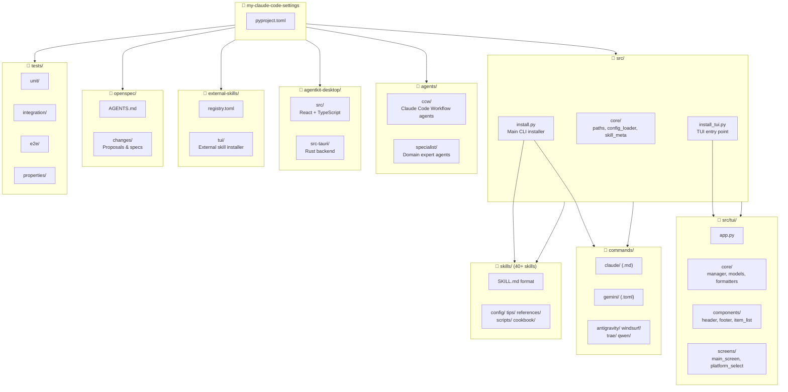

<!-- OPENSPEC:START -->
# OpenSpec Instructions

These instructions are for AI assistants working in this project.

Always open `@/openspec/AGENTS.md` when the request:
- Mentions planning or proposals (words like proposal, spec, change, plan)
- Introduces new capabilities, breaking changes, architecture shifts, or big performance/security work
- Sounds ambiguous and you need the authoritative spec before coding

Use `@/openspec/AGENTS.md` to learn:
- How to create and apply change proposals
- Spec format and conventions
- Project structure and guidelines

Keep this managed block so 'openspec update' can refresh the instructions.

<!-- OPENSPEC:END -->

# CLAUDE.md

> **Last Updated:** 2026-01-31 09:01:58

This file provides guidance to Claude Code (claude.ai/code) when working with code in this repository.

## Project Overview

**MyClaude Skills** is a comprehensive collection of Claude Code skills, prompts, and workflows for AI-assisted development. It provides:

- **Unified skill format** (`SKILL.md`) with YAML frontmatter
- **Cross-platform installation** to multiple targets: Claude Code, Codex CLI, Gemini CLI, Qwen Code, Google Antigravity, Windsurf, Trae, and OpenCode
- **Interactive TUI** for skill management
- **Desktop application** (AgentKit Desktop) built with Tauri + React
- **External skills registry** for community contributions

## Project Structure (Mermaid)



## Module Index

| Module | Path | Description | Local CLAUDE.md |
|--------|------|-------------|-----------------|
| **Core Installer** | `src/install.py` | CLI skill manager with SkillManager class | - |
| **Core Modules** | `src/core/` | Shared paths, config_loader, skill_meta | - |
| **TUI** | `src/tui/` | Textual-based interactive installer | ✅ |
| **Skills** | `skills/` | 40+ skill definitions | - |
| **Commands** | `commands/` | Platform-specific slash commands | - |
| **Agents** | `agents/` | AI agent definitions (CCW + Specialist) | ✅ |
| **AgentKit Desktop** | `agentkit-desktop/` | Tauri + React desktop app | ✅ |
| **External Skills** | `external-skills/` | External skill registry & installer | ✅ |
| **OpenSpec** | `openspec/` | Change proposal system | - |
| **Tests** | `tests/` | pytest test suite | - |
| **Docs** | `docs/` | VitePress documentation site | - |

## Common Commands

```bash
# Install all skills (default target: Claude)
uv run python src/install.py install-all

# Install to specific target
uv run python src/install.py --target gemini install-all
uv run python src/install.py --target codex install-all
uv run python src/install.py --target qwen install-all
uv run python src/install.py --target antigravity install-all
uv run python src/install.py --target windsurf install-all
uv run python src/install.py --target trae install-all
uv run python src/install.py --target trae-cn install-all

# Install to Qoder
uv run python src/install.py --target qoder install-all

# Install to OpenCode
uv run python src/install.py --target opencode install-all

# List available/installed skills
uv run python src/install.py list
uv run python src/install.py installed

# Install specific skill(s)
uv run python src/install.py install <skill-name> [skill2...]

# Sync prompts/CLAUDE.md to global config
uv run python src/install.py prompt-update
uv run python src/install.py prompt-diff

# TUI mode (requires Python 3.10+ and textual)
uv run python src/install_tui.py

# Run tests
uv run pytest tests/
uv run pytest tests/properties/test_install_properties.py -v

# Documentation (VitePress)
cd docs && npm install && npm run dev

# AgentKit Desktop (Tauri)
cd agentkit-desktop && npm install && npm run tauri dev

# External Skills TUI
uv run python external-skills/install_tui.py
```

## Architecture

### Core Components

- **`src/install.py`**: Main installer with `SkillManager` class handling skill discovery, installation, and prompt management. Target configs define installation paths for each platform.

- **`src/core/`**: Shared modules
  - `paths.py` - Unified path constants (PROJECT_ROOT, HOME_DIR, *_SRC_DIR)
  - `config_loader.py` - Platform configuration loading from `platforms.toml`
  - `skill_meta.py` - SKILL.md frontmatter parser

- **`src/tui/`**: Textual-based TUI application
  - `app.py` - Main app entry
  - `core/manager.py` - Installation manager with async progress support
  - `core/formatters.py` - Display formatting utilities
  - `core/models.py` - Data models (Item, Platform)
  - `components/` - UI components (header, footer, item_list, category_filter)
  - `screens/` - Screen definitions (main_screen, platform_select)
  - `styles.tcss` - Textual CSS styles

- **`agentkit-desktop/`**: Tauri v2 desktop application
  - `src/` - React + TypeScript frontend with Zustand stores
  - `src-tauri/` - Rust backend with SQLite database
  - Features: i18n (en/zh), platform management, resource sync

- **`agents/`**: AI agent definitions
  - `ccw/` - Claude Code Workflow agents (planning, execution, debugging)
  - `specialist/` - Domain expert agents (Python, TypeScript, CSS, etc.)

- **`external-skills/`**: External skill management
  - `registry.toml` - Skill registry with GitHub sources
  - `install.py` - CLI installer
  - `tui/` - Interactive TUI installer

### Content Structure

- **`skills/<name>/SKILL.md`**: Skill definitions with YAML frontmatter (`name`, `description`, optional `license`). May include subdirectories: `config/`, `tips/`, `references/`, `scripts/`, `cookbook/`

- **`commands/<platform>/`**: Slash commands per platform
  - `claude/` - Markdown files (`.md`) with nested directories (cc/, cli/, gh/, issue/, kiro/, memory/, task/, workflow/, zcf/)
  - `gemini/` - TOML files (`.toml`)
  - `antigravity/`, `windsurf/`, `trae/` - Markdown workflows
  - `qwen/` - Qwen-specific commands

- **`prompts/CLAUDE.md`**: Global workflow configuration synced via `prompt-update`

### Installation Targets

| Target | Skills Path | Commands Path |
|--------|-------------|---------------|
| claude | `~/.claude/skills/` | `~/.claude/commands/` |
| codex | `~/.codex/skills/` | `~/.codex/prompts/` |
| gemini | `~/.gemini/skills/` | `~/.gemini/commands/` |
| qwen | `~/.qwen/skills/` | `~/.qwen/commands/` |
| qoder | `~/.qoder/skills/` | `~/.qoder/commands/` |
| antigravity | `~/.gemini/antigravity/skills/` | `~/.gemini/antigravity/workflows/` |
| windsurf | `~/.codeium/windsurf/skills/` | `~/.codeium/windsurf/workflows/` |
| trae | `~/.trae/skills/` | `~/.trae/commands/` |
| trae-cn | `~/.trae-cn/skills/` | `~/.trae-cn/commands/` |
| opencode | `~/.config/opencode/skills/` | `~/.config/opencode/commands/` |

## Skill Definition Format

```yaml
---
name: skill-name
description: Brief description for listing
license: MIT  # optional
---

# Skill Title

Detailed instructions and documentation...
```

## Code Conventions

- Python 3.10+ required for TUI (Textual library)
- Tests use pytest with hypothesis for property-based testing
- Comments in English
- Follow existing patterns in `src/install.py` and `src/tui/` modules
- Rust code follows standard Rust conventions (src-tauri)
- TypeScript/React follows ESLint config in agentkit-desktop

## Key Skills (Highlights)

| Category | Skills |
|----------|--------|
| **Development** | `codex`, `explore`, `frontend-engineer`, `rust-cli-tui-developer` |
| **Documentation** | `document-writer`, `tech-blog`, `tech-design-doc` |
| **Academic** | `latex-paper-en`, `latex-thesis-zh`, `typst-paper`, `IEEE-writing-skills` |
| **Diagrams** | `drawio`, `excalidraw`, `mermaid_expert` |
| **AI/LLM** | `gemini`, `gemini-image`, `research` |
| **Code Quality** | `review-code`, `paper-check`, `skill-seekers` |
| **Git/GitHub** | `git-commit-cn`, `gh-bootstrap`, `github-to-skills` |

## Testing Strategy

```
tests/
├── unit/           # Unit tests for individual functions
├── integration/    # Integration tests for module interactions
├── e2e/            # End-to-end CLI/TUI tests
├── properties/     # Property-based tests (hypothesis)
├── manual/         # Manual test scripts
└── fixtures/       # Test fixtures and mock data
```

## Related Documentation

- `openspec/AGENTS.md` - Change proposal workflow
- `agentkit-desktop/DEVELOPER.md` - Desktop app development guide
- `external-skills/README.md` - External skills installation guide
- `docs/` - VitePress documentation site
