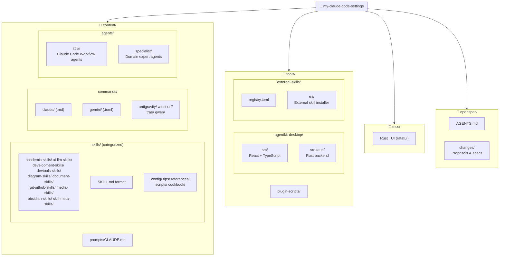

<!-- OPENSPEC:START -->
# OpenSpec Instructions

These instructions are for AI assistants working in this project.

Always open `@/openspec/AGENTS.md` when the request:
- Mentions planning or proposals (words like proposal, spec, change, plan)
- Introduces new capabilities, breaking changes, architecture shifts, or big performance/security work
- Sounds ambiguous and you need the authoritative spec before coding

Use `@/openspec/AGENTS.md` to learn:
- How to create and apply change proposals
- Spec format and conventions
- Project structure and guidelines

Keep this managed block so 'openspec update' can refresh the instructions.

<!-- OPENSPEC:END -->

# CLAUDE.md

> **Last Updated:** 2026-01-31 09:01:58

This file provides guidance to Claude Code (claude.ai/code) when working with code in this repository.

## Project Overview

**MyClaude Skills** is a comprehensive collection of Claude Code skills, prompts, and workflows for AI-assisted development. It provides:

- **Unified skill format** (`SKILL.md`) with YAML frontmatter
- **Cross-platform installation** to multiple targets: Claude Code, Codex CLI, Gemini CLI, Qwen Code, Google Antigravity, Windsurf, Trae, and OpenCode
- **Interactive Rust TUI** (`mcs/`) for skill management
- **Desktop application** (AgentKit Desktop) built with Tauri + React
- **External skills registry** for community contributions

## Project Structure (Mermaid)



## Module Index

| Module | Path | Description | Local CLAUDE.md |
|--------|------|-------------|-----------------|
| **Rust TUI** | `mcs/` | Rust-based interactive installer (ratatui) | ✅ |
| **Skills** | `content/skills/` | Categorized skill definitions (10 categories) | - |
| **Commands** | `content/commands/` | Platform-specific slash commands | - |
| **Agents** | `content/agents/` | AI agent definitions (CCW + Specialist) | ✅ |
| **Prompts** | `content/prompts/` | Global prompt configuration | - |
| **AgentKit Desktop** | `tools/agentkit-desktop/` | Tauri + React desktop app | ✅ |
| **External Skills** | `tools/external-skills/` | External skill registry & installer | ✅ |
| **Plugin Scripts** | `tools/plugin-scripts/` | Claude plugin installer scripts | - |
| **OpenSpec** | `openspec/` | Change proposal system | - |
| **Docs** | `docs/` | VitePress documentation site | - |

## Common Commands

```bash
# TUI mode (Rust MCS) - skill browsing and installation
just mcs

# Documentation (VitePress)
cd docs && npm install && npm run dev

# AgentKit Desktop (Tauri)
cd tools/agentkit-desktop && npm install && npm run tauri dev

# External Skills TUI
uv run python tools/external-skills/install_tui.py

# CI checks (TypeScript + Rust)
just ci
```

## Architecture

### Core Components

- **`mcs/`**: Rust TUI application (ratatui + crossterm)
  - Interactive skill browser with keyboard navigation
  - Detects project root via `walk_up_for_content()`

- **`tools/agentkit-desktop/`**: Tauri v2 desktop application
  - `src/` - React + TypeScript frontend with Zustand stores
  - `src-tauri/` - Rust backend with SQLite database
  - Features: i18n (en/zh), platform management, resource sync

- **`content/agents/`**: AI agent definitions
  - `ccw/` - Claude Code Workflow agents (planning, execution, debugging)
  - `specialist/` - Domain expert agents (Python, TypeScript, CSS, etc.)

- **`tools/external-skills/`**: External skill management
  - `registry.toml` - Skill registry with GitHub sources
  - `install.py` - CLI installer
  - `tui/` - Interactive TUI installer

### Content Structure

- **`content/skills/<category>/<name>/SKILL.md`**: Skill definitions organized in category folders (`academic-skills/`, `ai-llm-skills/`, `development-skills/`, `devtools-skills/`, `diagram-skills/`, `document-skills/`, `git-github-skills/`, `media-skills/`, `obsidian-skills/`, `skill-meta-skills/`). Each skill has YAML frontmatter (`name`, `description`, optional `license`). May include subdirectories: `config/`, `tips/`, `references/`, `scripts/`, `cookbook/`. `default.toml` controls which categories are installed by `install-all`.

- **`content/commands/<platform>/`**: Slash commands per platform
  - `claude/` - Markdown files (`.md`) with nested directories (cc/, cli/, gh/, issue/, kiro/, memory/, task/, workflow/, zcf/)
  - `gemini/` - TOML files (`.toml`)
  - `antigravity/`, `windsurf/`, `trae/` - Markdown workflows
  - `qwen/` - Qwen-specific commands

- **`content/prompts/CLAUDE.md`**: Global workflow configuration synced via `prompt-update`

### Installation Targets

| Target | Skills Path | Commands Path |
|--------|-------------|---------------|
| claude | `~/.claude/skills/` | `~/.claude/commands/` |
| codex | `~/.codex/skills/` | `~/.codex/prompts/` |
| gemini | `~/.gemini/skills/` | `~/.gemini/commands/` |
| qwen | `~/.qwen/skills/` | `~/.qwen/commands/` |
| qoder | `~/.qoder/skills/` | `~/.qoder/commands/` |
| antigravity | `~/.gemini/antigravity/skills/` | `~/.gemini/antigravity/workflows/` |
| windsurf | `~/.codeium/windsurf/skills/` | `~/.codeium/windsurf/workflows/` |
| trae | `~/.trae/skills/` | `~/.trae/commands/` |
| trae-cn | `~/.trae-cn/skills/` | `~/.trae-cn/commands/` |
| opencode | `~/.config/opencode/skills/` | `~/.config/opencode/commands/` |

## Skill Definition Format

```yaml
---
name: skill-name
description: Brief description for listing
license: MIT  # optional
---

# Skill Title

Detailed instructions and documentation...
```

## Code Conventions

- Comments in English
- Rust code follows standard Rust conventions (`mcs/`, `tools/agentkit-desktop/src-tauri/`)
- TypeScript/React follows ESLint config in `tools/agentkit-desktop`
- Follow existing patterns in `mcs/` modules

## Key Skills (Highlights)

| Category | Folder | Skills |
|----------|--------|--------|
| **Academic** | `academic-skills/` | `latex-paper-en`, `latex-thesis-zh`, `typst-paper`, `IEEE-writing-skills` |
| **AI & LLM** | `ai-llm-skills/` | `codex`, `gemini`, `gemini-image`, `research` |
| **Development** | `development-skills/` | `frontend-engineer`, `rust-cli-tui-developer`, `lib-slint-expert` |
| **Dev Tools** | `devtools-skills/` | `review-code`, `memory-system`, `planning-with-files` |
| **Diagrams** | `diagram-skills/` | `drawio`, `excalidraw`, `mermaid_expert` |
| **Documentation** | `document-skills/` | `document-writer`, `tech-blog`, `docx`, `pdf` |
| **Git & GitHub** | `git-github-skills/` | `git-commit-cn`, `gh-bootstrap`, `gh-fix-ci` |
| **Media** | `media-skills/` | `article-cover`, `yt-dlp` |
| **Obsidian** | `obsidian-skills/` | `obsidian-cli`, `obsidian-markdown`, `json-canvas` |
| **Skill Dev** | `skill-meta-skills/` | `skill-seekers`, `github-to-skills`, `mcp-to-skill` |

## Related Documentation

- `openspec/AGENTS.md` - Change proposal workflow
- `tools/agentkit-desktop/DEVELOPER.md` - Desktop app development guide
- `tools/external-skills/README.md` - External skills installation guide
- `docs/` - VitePress documentation site
