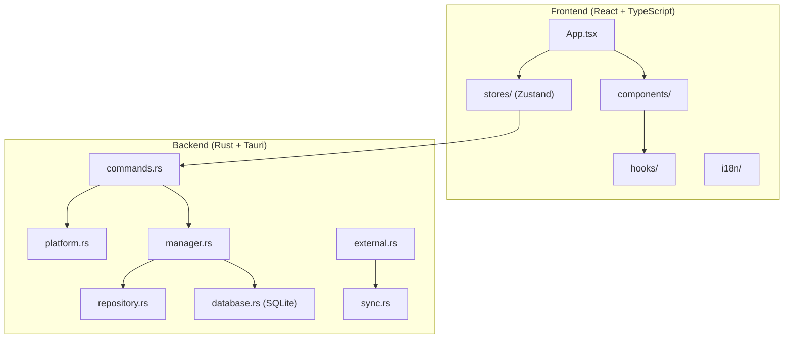

# AgentKit Desktop

> 🏠 [← Back to Root](../CLAUDE.md) | 📁 `agentkit-desktop/`

Cross-platform desktop application for managing AI skills and resources, built with Tauri v2 + React.

## Overview

AgentKit Desktop provides a graphical interface for:
- Managing skills across multiple AI platforms
- Syncing resources from external registries
- Platform-specific configuration
- i18n support (English/Chinese)

## Architecture



## Frontend Structure

```
src/
├── App.tsx                 # Main application component
├── main.tsx               # Entry point
├── index.css              # Global styles (Tailwind)
├── components/
│   ├── index.ts           # Component exports
│   ├── ComponentErrorBoundary.tsx
│   ├── ErrorBoundary.tsx
│   ├── ExternalPanel.tsx  # External skills panel
│   ├── FilterPanel.tsx    # Filter controls
│   ├── PlatformSelector.tsx
│   ├── ResourceCard.tsx   # Skill/resource card
│   ├── ResourceDetail.tsx # Detail view
│   ├── StatusBadge.tsx    # Status indicators
│   └── Toast.tsx          # Notifications
├── hooks/
│   ├── index.ts
│   └── useToast.ts        # Toast notifications hook
├── stores/
│   ├── index.ts
│   ├── platformStore.ts   # Platform state
│   ├── resourceStore.ts   # Resources state
│   └── settingsStore.ts   # App settings
├── i18n/
│   ├── index.ts           # i18n setup
│   └── locales/
│       ├── en.json        # English translations
│       └── zh.json        # Chinese translations
├── types/
│   └── index.ts           # TypeScript types
└── utils/
    ├── index.ts
    └── errorUtils.ts      # Error handling utilities
```

## Backend Structure (Rust)

```
src-tauri/
├── src/
│   ├── main.rs            # Application entry
│   ├── lib.rs             # Library exports
│   ├── commands.rs        # Tauri commands (IPC)
│   ├── manager.rs         # Resource management
│   ├── platform.rs        # Platform detection/config
│   ├── database.rs        # SQLite operations
│   ├── repository.rs      # Data repository layer
│   ├── external.rs        # External skill handling
│   ├── sync.rs            # Sync operations
│   ├── models.rs          # Data models
│   └── schema.sql         # Database schema
├── capabilities/
│   └── default.json       # Tauri capabilities
├── icons/                 # App icons
├── Cargo.toml            # Rust dependencies
└── tauri.conf.json       # Tauri configuration
```

## Key Technologies

| Layer | Technology |
|-------|------------|
| Framework | Tauri v2 |
| Frontend | React 18 + TypeScript |
| Styling | Tailwind CSS |
| State | Zustand |
| i18n | i18next |
| Backend | Rust |
| Database | SQLite (rusqlite) |
| Build | Vite |
| Testing | Vitest |

## Development Commands

```bash
# Install dependencies
npm install

# Development mode
npm run tauri dev

# Build for production
npm run tauri build

# Run frontend tests
npm run test

# Lint
npm run lint

# Type check
npm run typecheck
```

## Tauri Commands (IPC)

Commands exposed to frontend via `@tauri-apps/api/core`:

| Command | Description |
|---------|-------------|
| `get_platforms` | List available platforms |
| `get_resources` | Get resources for platform |
| `install_resource` | Install a skill/command |
| `uninstall_resource` | Remove a skill/command |
| `sync_external` | Sync external registry |
| `get_settings` | Get app settings |
| `update_settings` | Update app settings |

## Database Schema

SQLite database stores:
- Platform configurations
- Installed resources
- Sync state
- User preferences

See `src-tauri/src/schema.sql` for full schema.

## Testing

```bash
# Frontend unit tests
npm run test

# Run specific test file
npm run test -- src/test/ResourceCard.test.tsx

# Watch mode
npm run test -- --watch
```

## Related Documentation

- `DEVELOPER.md` - Detailed development guide
- `README.md` - Quick start guide
- `../openspec/changes/agentkit-desktop-app/` - Design specs and proposals
