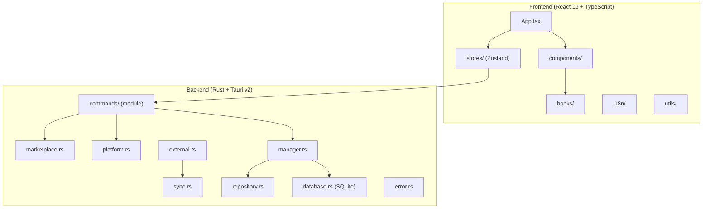

# AgentKit Desktop

> [<- Back to Root](../CLAUDE.md) | `agentkit-desktop/`

Cross-platform desktop application for managing AI skills and resources, built with Tauri v2 + React 19.

## Overview

AgentKit Desktop provides a graphical interface for:
- Managing skills, commands, and agents across multiple AI platforms
- Browsing and installing from a marketplace
- Syncing resources from external registries (npm, pip, git)
- Platform-specific configuration and detection
- i18n support (English/Chinese)

## Architecture



## Frontend Structure

```
src/
├── App.tsx                 # Main app component (layout orchestrator)
├── main.tsx                # Entry point
├── index.css               # Global styles (Tailwind CSS 4)
├── vite-env.d.ts           # Vite type declarations
├── components/
│   ├── index.ts            # Barrel exports
│   ├── ConfirmDialog.tsx   # Modal confirmation dialog (portal-based)
│   ├── Sidebar.tsx         # Navigation sidebar (extracted from App)
│   ├── ResourceListPanel.tsx # Resource grid/list view (extracted from App)
│   ├── ComponentErrorBoundary.tsx  # Reusable error boundary wrapper
│   ├── ErrorBoundary.tsx   # Top-level error boundary
│   ├── ExternalPanel.tsx   # External skills management panel
│   ├── FilterPanel.tsx     # Filter/search controls
│   ├── MarketFilterBar.tsx # Marketplace search and category filter
│   ├── MarketplacePanel.tsx # Marketplace browsing panel
│   ├── NavItem.tsx         # Sidebar navigation item
│   ├── PlatformSelector.tsx # Platform multi-select
│   ├── ResourceCard.tsx    # Skill/command/agent card
│   ├── ResourceDetail.tsx  # Detail view panel
│   ├── SkillCard.tsx       # Marketplace skill card
│   ├── SortTabs.tsx        # Sort order tabs
│   ├── StatusBadge.tsx     # Status indicators
│   ├── Toast.tsx           # Toast notifications
│   ├── icons/
│   │   └── AgentKitLogo.tsx # App logo component
│   └── settings/
│       ├── SettingsPage.tsx # Settings page layout
│       ├── ToolStatus.tsx  # External tool status checks
│       └── AboutCard.tsx   # App version and about info
├── hooks/
│   ├── index.ts            # Barrel exports
│   ├── useBatchOperations.ts # Batch install/uninstall with confirmation
│   ├── useResourceFilters.ts # Resource filtering and sorting logic
│   └── useToast.ts         # Toast notification hook (legacy, wraps store)
├── stores/
│   ├── index.ts            # Barrel exports
│   ├── toastStore.ts       # Toast notification state (Zustand)
│   ├── marketplaceStore.ts # Marketplace data and search state
│   ├── platformStore.ts    # Platform detection and selection
│   ├── resourceStore.ts    # Resource CRUD and sync state
│   └── settingsStore.ts    # App settings, theme, language
├── i18n/
│   ├── index.ts            # i18n initialization (i18next + react-i18next)
│   └── locales/
│       ├── en.json         # English translations
│       └── zh.json         # Chinese translations
├── types/
│   └── index.ts            # TypeScript type definitions
├── utils/
│   ├── index.ts            # Barrel exports
│   ├── errorUtils.ts       # Error parsing, classification, toast helpers
│   └── resourceUtils.ts    # Shared getTypeIcon and resource utilities
└── test/
    ├── setup.ts            # Vitest setup (jsdom, mocks)
    ├── commands.test.ts    # Tauri command mock tests
    ├── errorUtils.test.ts  # Error utility tests
    ├── ErrorBoundary.test.tsx
    ├── ResourceCard.test.tsx
    ├── StatusBadge.test.tsx
    └── Toast.test.tsx
```

## Backend Structure (Rust)

```
src-tauri/
├── src/
│   ├── main.rs             # Application entry, source path resolution
│   ├── lib.rs              # Module declarations
│   ├── error.rs            # CommandError enum (thiserror + Serialize)
│   ├── models.rs           # Data models with strum derives
│   ├── database.rs         # SQLite operations + migration system
│   ├── schema.sql          # Database schema (v1 baseline)
│   ├── repository.rs       # Data access layer
│   ├── manager.rs          # Resource install/uninstall logic
│   ├── platform.rs         # Platform detection and path resolution
│   ├── external.rs         # External skill handler (npm/pip/git)
│   ├── sync.rs             # File sync engine (symlink/junction/copy)
│   ├── marketplace.rs      # Marketplace API client
│   ├── marketplace_cache.rs # Marketplace data caching
│   ├── skill_installer.rs  # Skill installation orchestrator
│   ├── logging.rs          # Structured logging (tracing)
│   ├── utils.rs            # Shared utilities
│   └── commands/           # Tauri IPC command module
│       ├── mod.rs          # AppState definition + re-exports
│       ├── resource.rs     # Resource CRUD commands
│       ├── platform.rs     # Platform detection commands
│       ├── settings.rs     # Settings get/update commands
│       ├── external.rs     # External skills commands
│       ├── marketplace.rs  # Marketplace browsing/install commands
│       └── logging.rs      # Log management commands
├── capabilities/
│   └── default.json        # Tauri v2 capability permissions
├── icons/                  # App icons (all sizes)
├── Cargo.toml              # Rust dependencies
└── tauri.conf.json         # Tauri configuration
```

## Key Technologies

| Layer | Technology | Version |
|-------|------------|---------|
| Framework | Tauri | v2.5+ |
| Frontend | React + TypeScript | 19.x / 5.9 |
| Styling | Tailwind CSS | v4 |
| State | Zustand | v5 |
| Animation | Framer Motion | v12 |
| i18n | i18next + react-i18next | 25.x / 16.x |
| Icons | Lucide React | latest |
| Backend | Rust | 2021 edition |
| Database | SQLite (rusqlite) | 0.32 |
| HTTP | reqwest | 0.13 |
| Enums | strum | 0.26 |
| Errors | thiserror + anyhow | 2.x / 1.x |
| Logging | tracing | latest |
| Async Runtime | tokio (rt, macros) | 1.x |
| Build | Vite | v7 |
| Testing | Vitest + Testing Library | v4 |

## Development Commands

```bash
# Install dependencies
npm install

# Development mode (starts both frontend and backend)
npm run tauri dev

# Build for production
npm run tauri build

# Frontend tests
npm run test                              # Run all tests
npm run test -- src/test/ResourceCard.test.tsx  # Specific test
npm run test:watch                        # Watch mode
npm run test:coverage                     # Coverage report

# Lint and format
npm run lint                              # ESLint
npm run format                            # Prettier

# Type check (no dedicated script - use directly)
npx tsc --noEmit

# Rust check
cd src-tauri && cargo check

# Rust tests (database migration tests)
cd src-tauri && cargo test database
```

## Tauri Commands (IPC)

Commands exposed to frontend via `@tauri-apps/api/core`:

### Platform Commands
| Command | Description |
|---------|-------------|
| `detect_platforms` | Auto-detect installed AI platforms |
| `get_platforms` | List all known platforms |
| `get_platform_info` | Get details for a specific platform |

### Resource Commands
| Command | Description |
|---------|-------------|
| `get_resources` | Get resources for a platform |
| `get_resource_by_id` | Get a single resource by ID |
| `install_resource` | Install a skill/command to platforms |
| `uninstall_resource` | Remove a skill/command |
| `update_resource` | Update resource metadata |
| `sync_resource` | Sync a resource's files |
| `refresh_resources` | Re-scan and refresh resource list |

### External Skills Commands
| Command | Description |
|---------|-------------|
| `get_external_skills` | List external skill sources |
| `install_external_skill` | Install from npm/pip/git |
| `check_external_handlers` | Check if npm/pip/git are available |

### Settings Commands
| Command | Description |
|---------|-------------|
| `get_settings` | Get app settings |
| `update_settings` | Update app settings |

### Marketplace Commands
| Command | Description |
|---------|-------------|
| `get_marketplace_skills` | Browse marketplace catalog |
| `search_marketplace` | Search marketplace by query |
| `install_marketplace_skill` | Install from marketplace |
| `uninstall_marketplace_skill` | Remove marketplace skill |
| `refresh_marketplace_cache` | Refresh cached marketplace data |
| `get_marketplace_categories` | Get available categories |
| `check_nodejs_available` | Check if Node.js is installed |
| `get_nodejs_version` | Get Node.js version string |
| `get_marketplace_cache_stats` | Get cache size and age info |

### Logging Commands
| Command | Description |
|---------|-------------|
| `get_log_info` | Get log file location and size |
| `cleanup_logs` | Remove old log files |

## Database

SQLite database with versioned migration system.

- **Schema version**: 2 (auto-migrated on startup)
- **Migration system**: `database.rs` applies migrations sequentially; each migration is idempotent
- **PRAGMA foreign_keys**: Set per-connection (not in schema.sql)
- **Trigger**: `update_resources_timestamp` uses WHEN guard to prevent recursive firing

Tables: `resources`, `platforms`, `settings`, `sync_state`

See `src-tauri/src/schema.sql` for baseline schema and `database.rs` for migrations.

## Key Patterns

### Error Handling (Rust)
All commands return `Result<T, CommandError>` where `CommandError` is a thiserror enum with custom Serialize. Error types: `Database`, `NotFound`, `Io`, `Validation`, `Platform`, `External`, `Network`.

### State Management (Frontend)
Zustand stores with loading counters (not booleans) to handle concurrent async operations. Stores can be accessed outside React via `useStore.getState()`.

### i18n
All user-visible strings use `t('key')` from `react-i18next`. Keys organized by domain: `resource.*`, `action.*`, `status.*`, `filter.*`, `settings.*`, `marketplace.*`, etc.

### Enum Serialization (Rust)
Models use `strum::Display` + `strum::EnumString` for string conversion alongside `serde`. Special case: `Platform::OpenCode` uses `#[strum(serialize = "opencode")]` to match DB values.

## Testing

```bash
# Frontend unit tests (Vitest + jsdom)
npm run test

# Specific test file
npm run test -- src/test/ResourceCard.test.tsx

# Watch mode
npm run test:watch

# Coverage
npm run test:coverage

# Rust tests (database)
cd src-tauri && cargo test database
```

Existing test coverage: `ResourceCard`, `ErrorBoundary`, `StatusBadge`, `Toast`, `errorUtils`, `commands` (mock).

## Related Documentation

- `README.md` - Quick start guide
- `OPTIMIZATION_PLAN.md` - Optimization plan (38 issues, 5 phases)
- `../openspec/changes/agentkit-desktop-app/` - Design specs and proposals
