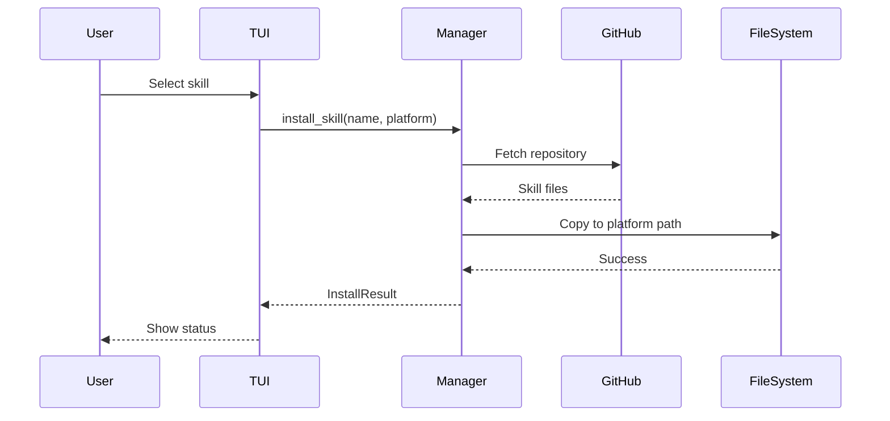

# External Skills Module

> 🏠 [← Back to Root](../CLAUDE.md) | 📁 `external-skills/`

External skill registry and installer for community-contributed skills.

## Overview

This module provides infrastructure for discovering, installing, and managing skills from external sources (primarily GitHub repositories).

## Structure

```
external-skills/
├── registry.toml          # Skill registry (GitHub sources)
├── install.py             # CLI installer
├── install.md             # Installation documentation
├── install_tui.py         # TUI entry point
├── README.md              # Module documentation
└── tui/                   # TUI application
    ├── app.py             # Main TUI app
    ├── __main__.py        # Module entry point
    ├── styles.tcss        # Textual CSS
    ├── components/
    │   ├── __init__.py
    │   ├── footer.py
    │   ├── skill_detail.py
    │   └── skill_list.py
    ├── core/
    │   ├── __init__.py
    │   ├── manager.py     # External skill manager
    │   └── models.py      # Data models
    ├── screens/
    │   ├── __init__.py
    │   ├── main_screen.py
    │   └── platform_select.py
    └── tests/             # Property-based tests
        ├── __init__.py
        ├── test_manager.py
        ├── test_models.py
        ├── test_property_*.py
        └── ...
```

## Registry Format

`registry.toml` defines external skills:

```toml
[skills.skill-name]
name = "skill-name"
description = "Brief description"
repo = "owner/repo"
branch = "main"
path = "path/to/skill"  # optional, defaults to root
```

## Key Components

### CLI Installer (`install.py`)

```bash
# List available external skills
python external-skills/install.py list

# Install a skill
python external-skills/install.py install <skill-name>

# Install to specific platform
python external-skills/install.py --target gemini install <skill-name>
```

### TUI Installer (`install_tui.py`)

Interactive terminal interface for browsing and installing external skills:

```bash
python external-skills/install_tui.py
```

### Core Manager (`tui/core/manager.py`)

Handles:
- Registry parsing
- GitHub repository fetching
- Skill installation/uninstallation
- Dependency checking

### Data Models (`tui/core/models.py`)

- `ExternalSkill` - External skill metadata
- `InstallResult` - Installation result status
- `Platform` - Target platform configuration

## Installation Flow



## Testing

```bash
# Run external-skills tests
pytest external-skills/tui/tests/

# Property-based tests
pytest external-skills/tui/tests/test_property_*.py
```

## Dependencies

- Python 3.10+
- `textual` - TUI framework
- `httpx` or `requests` - HTTP client for GitHub API
- `toml` - Registry parsing

## Adding New Skills to Registry

1. Fork the repository or create a PR
2. Add entry to `registry.toml`:
   ```toml
   [skills.my-new-skill]
   name = "my-new-skill"
   description = "What this skill does"
   repo = "github-user/repo-name"
   branch = "main"
   path = "skills/my-skill"  # if not at repo root
   ```
3. Ensure the skill follows `SKILL.md` format
