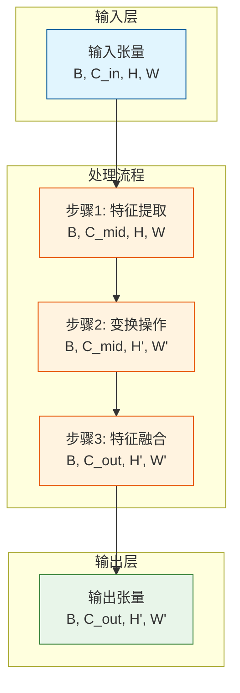
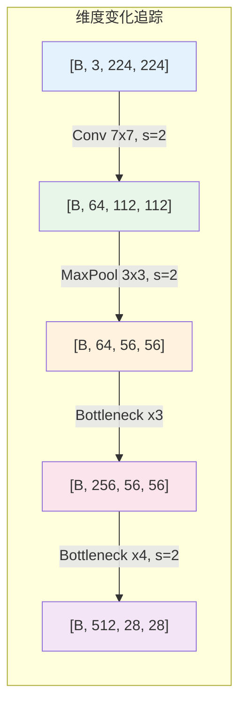
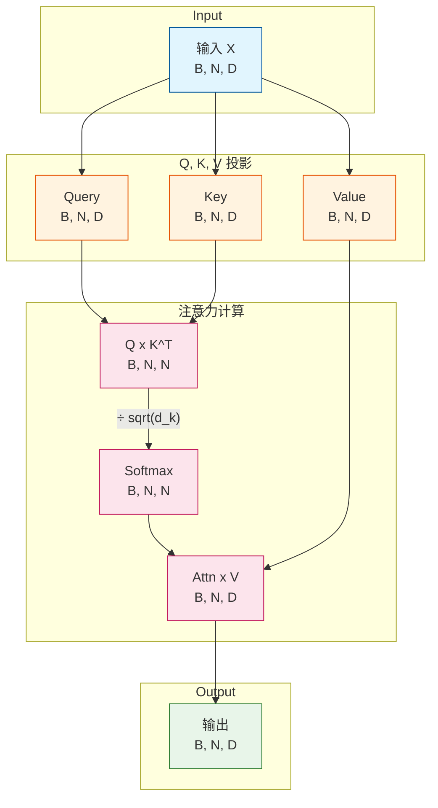
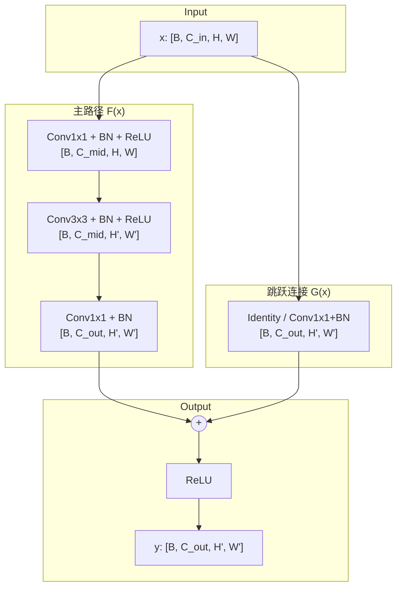

# DOCUMENTATION_GUIDE

## Contents

1. Module document structure
2. Mermaid flowchart templates
3. Formula documentation standard
4. Adaptive docs output structure
5. Module document example

## 1. Module Document Structure

每个核心模块文档至少包含以下部分：

```markdown
# [模块名称] 技术文档

## 1. 模块概述
- 功能描述
- 在整体架构中的位置
- 输入输出规格

## 2. 数学原理
- 核心公式 (LaTeX)
- 符号说明表
- 公式推导过程 (如适用)

## 3. 数据流图
- Mermaid 流程图
- 张量形状变化追踪

## 4. 实现细节
- 关键代码片段
- 超参数说明
- 设计决策说明

## 5. 使用示例
- 代码示例
- 输入输出示例

## 6. 注意事项
- 常见问题
- 性能考量
- 与论文的差异 (如有)
```

简单模型可以合并 2-3 个小节，但不要丢掉输入输出规格、实现细节和注意事项。

## 2. Mermaid Flowchart Templates

### 2.1 Internal Module Flow

```markdown
## 数据流图

### 整体流程


```

### 2.2 Tensor Shape Transition Diagram

```markdown
### 张量形状变化


```

### 2.3 Attention Flow Template

```markdown
### 注意力计算流程


```

### 2.4 Residual Connection Template

```markdown
### 残差连接结构

```mermaid
flowchart TB
    subgraph Block["残差块"]
        I[输入 x]

        subgraph Main["主路径 F(x)"]
            M1[Layer 1]
            M2[Layer 2]
            M3[Layer 3]
        end

        subgraph Skip["跳跃连接"]
            S[Identity / Projection]
        end

        Add((+))
        O[输出 y = F(x) + x]
    end

    I --> M1 --> M2 --> M3 --> Add
    I --> S --> Add
    Add --> O

    style I fill:#e1f5fe
    style M1 fill:#fff3e0
    style M2 fill:#fff3e0
    style M3 fill:#fff3e0
    style S fill:#fce4ec
    style Add fill:#f3e5f5
    style O fill:#e8f5e9
```
```

## 3. Formula Documentation Standard

### 3.1 Core Formula Layout

```markdown
## 数学原理

### 核心公式

**[公式名称]**:

$$
\text{Attention}(Q, K, V) = \text{softmax}\left(\frac{QK^T}{\sqrt{d_k}}\right)V
$$

**公式解释**:
- 该公式计算缩放点积注意力
- 缩放因子 $\sqrt{d_k}$ 防止点积值过大导致 softmax 梯度消失

**符号说明**:

| 符号 | 含义 | 维度 | 取值范围 |
|------|------|------|----------|
| $Q$ | Query 矩阵 | $[B, N, d_k]$ | $\mathbb{R}$ |
| $K$ | Key 矩阵 | $[B, N, d_k]$ | $\mathbb{R}$ |
| $V$ | Value 矩阵 | $[B, N, d_v]$ | $\mathbb{R}$ |
| $d_k$ | Key 维度 | scalar | 通常 64 |
| $N$ | 序列长度 | scalar | > 0 |
| $B$ | 批次大小 | scalar | > 0 |

**维度推导**:

1. $QK^T$: $[B, N, d_k] \times [B, d_k, N] = [B, N, N]$
2. $\text{softmax}(\cdot)$: $[B, N, N]$
3. $\text{Attn} \times V$: $[B, N, N] \times [B, N, d_v] = [B, N, d_v]$
```

### 3.2 Derivation Block for Complex Formulas

```markdown
### 公式推导

**目标**: 推导 Layer Normalization 的反向传播公式

**前向传播**:

$$
\hat{x}_i = \frac{x_i - \mu}{\sqrt{\sigma^2 + \epsilon}}
$$

$$
y_i = \gamma \hat{x}_i + \beta
$$

其中:
- $\mu = \frac{1}{D}\sum_{i=1}^{D} x_i$
- $\sigma^2 = \frac{1}{D}\sum_{i=1}^{D} (x_i - \mu)^2$

**反向传播推导**:

Step 1: 计算 $\frac{\partial \mathcal{L}}{\partial \hat{x}_i}$

$$
\frac{\partial \mathcal{L}}{\partial \hat{x}_i} = \frac{\partial \mathcal{L}}{\partial y_i} \cdot \gamma
$$

Step 2: 计算 $\frac{\partial \mathcal{L}}{\partial \sigma^2}$

$$
\frac{\partial \mathcal{L}}{\partial \sigma^2} =
\sum_{i=1}^{D} \frac{\partial \mathcal{L}}{\partial \hat{x}_i}
\cdot (x_i - \mu) \cdot \left(-\frac{1}{2}\right)(\sigma^2 + \epsilon)^{-3/2}
$$
```

### 3.3 Loss Function Analysis

```markdown
### Loss Function 分析

**总损失函数**:

$$
\mathcal{L}_{total} = \mathcal{L}_{cls} + \lambda_1 \mathcal{L}_{reg} + \lambda_2 \mathcal{L}_{aux}
$$

**各项说明**:

| 损失项 | 公式 | 作用 | 权重 |
|--------|------|------|------|
| $\mathcal{L}_{cls}$ | $-\sum_i y_i \log(\hat{y}_i)$ | 分类损失 | 1.0 |
| $\mathcal{L}_{reg}$ | $\|\|W\|\|_2^2$ | L2 正则化 | $\lambda_1 = 0.01$ |
| $\mathcal{L}_{aux}$ | 见下文 | 辅助监督 | $\lambda_2 = 0.4$ |

**辅助损失详解**:

$$
\mathcal{L}_{aux} = \text{CrossEntropy}(\text{AuxHead}(f_{mid}), y)
$$

- 作用：在中间层添加监督信号，缓解梯度消失
- 来源：Paper Section 4.2
- 注意：仅在训练时使用，推理时移除
```

## 4. Adaptive Docs Output Structure

根据模型复杂度调整输出目录，不强制对简单模型生成庞大的文档树。

### Simple Model

```text
output/
├── model.py
└── README.md
```

### Medium Model

```text
output/
├── model.py
├── modules/
└── README.md
```

### Complex Model

```text
output/
├── README.md
├── docs/
│   ├── architecture.md
│   ├── modules/
│   │   ├── backbone.md
│   │   ├── attention.md
│   │   ├── head.md
│   │   └── loss.md
│   ├── math/
│   │   ├── formulas.md
│   │   └── derivations.md
│   └── diagrams/
│       ├── overview.md
│       └── tensor_shapes.md
├── model.py
├── modules/
├── config.py
└── requirements.txt
```

## 5. Module Document Example

```markdown
# Bottleneck Block 技术文档

## 1. 模块概述

**功能**: ResNet 的核心构建块，通过残差连接实现深层网络的有效训练。

**架构位置**: 位于 ResNet 的 Stage 2-5，每个 Stage 包含多个 Bottleneck 块。

**输入输出规格**:
- 输入: `[B, C_in, H, W]`
- 输出: `[B, C_out, H', W']`
- 其中 `C_out = C_mid x 4`

## 2. 数学原理

### 残差映射公式

$$
\mathbf{y} = \mathcal{F}(\mathbf{x}, \{W_i\}) + \mathcal{G}(\mathbf{x})
$$

其中:

$$
\mathcal{F}(\mathbf{x}) = W_3 \cdot \text{ReLU}(W_2 \cdot \text{ReLU}(W_1 \cdot \mathbf{x}))
$$

$$
\mathcal{G}(\mathbf{x}) = \begin{cases}
\mathbf{x} & \text{if } C_{in} = C_{out} \text{ and } s = 1 \\
W_s \cdot \mathbf{x} & \text{otherwise}
\end{cases}
$$

## 3. 数据流图



## 4. 实现细节

```python
class Bottleneck(nn.Module):
    expansion = 4

    def __init__(self, in_ch, mid_ch, stride=1, downsample=None):
        super().__init__()
        out_ch = mid_ch * self.expansion
        self.conv1 = nn.Conv2d(in_ch, mid_ch, 1, bias=False)
        self.bn1 = nn.BatchNorm2d(mid_ch)
        self.conv2 = nn.Conv2d(mid_ch, mid_ch, 3, stride, 1, bias=False)
        self.bn2 = nn.BatchNorm2d(mid_ch)
        self.conv3 = nn.Conv2d(mid_ch, out_ch, 1, bias=False)
        self.bn3 = nn.BatchNorm2d(out_ch)
        self.relu = nn.ReLU(inplace=True)
        self.downsample = downsample
```

## 5. 使用示例

```python
block = Bottleneck(in_ch=256, mid_ch=64)
x = torch.randn(2, 256, 56, 56)
y = block(x)
```

## 6. 注意事项

1. 当 stride > 1 或通道数变化时，必须提供 downsample。
2. 残差连接确保梯度可以直接回传。
3. 1x1 卷积减少计算量，相比直接使用 3x3 更节省。
```
