# Mermaid Syntax Reference

Focused syntax reference for generating Mermaid diagrams. Covers all 7 diagram types with concise examples.

## Flowcharts

**Directions:** `TD`/`TB` (top-down), `BT`, `LR`, `RL`

**Node shapes:**
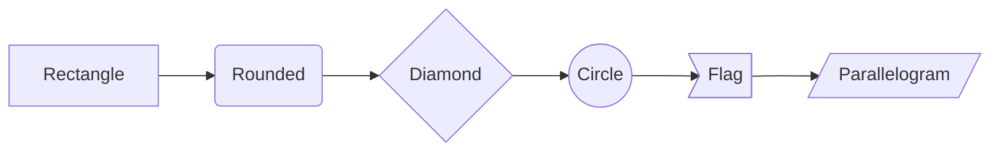

**Link types:**
```
A --> B        %% Arrow
A --- B        %% Line (no arrow)
A -.-> B       %% Dotted arrow
A ==> B        %% Thick arrow
A -->|label| B %% Arrow with text
A -- text --- B %% Line with text
```

**Subgraphs:**
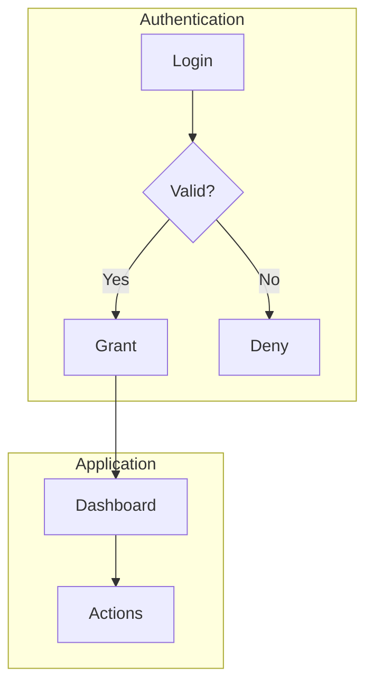

**Styling:**
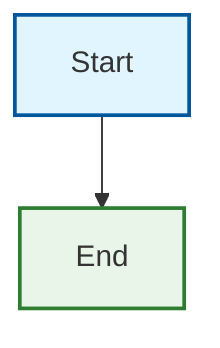

**Class-based styles:**
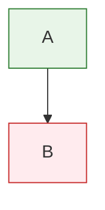

## Sequence Diagrams

**Message types:**
```
A->>B    %% Solid arrow (synchronous)
A-->>B   %% Dashed arrow (response/async)
A-xB     %% Solid with X (lost message)
A--xB    %% Dashed with X
```

**Full example:**
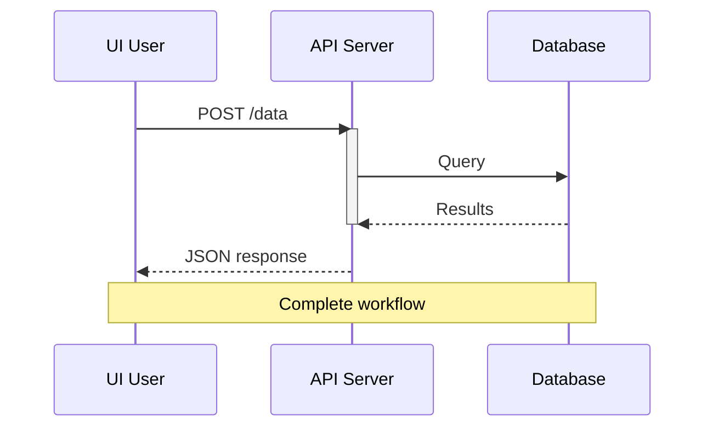

**Loops and conditionals:**
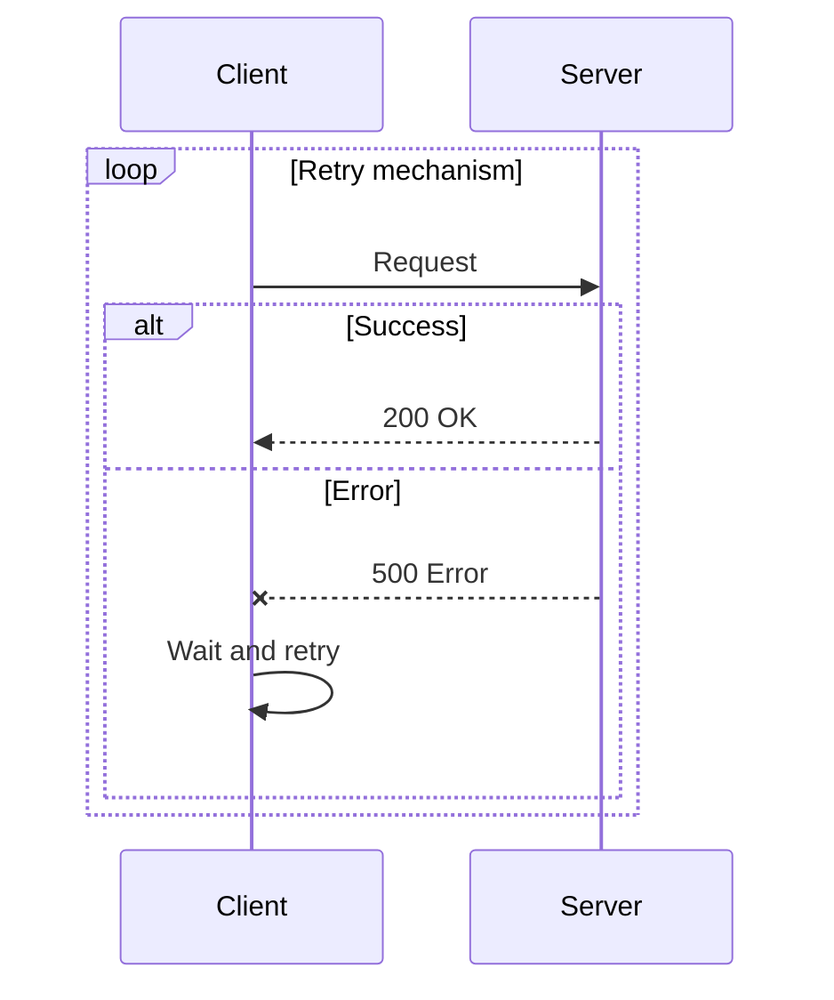

## Class Diagrams

**Class definition:**
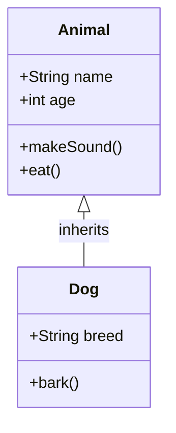

**Relationship types:**
```
A <|-- B    %% Inheritance
A *-- B     %% Composition
A o-- B     %% Aggregation
A --> B     %% Association
A ..> B     %% Dependency
A ..|> B    %% Realization
```

**Cardinality:**
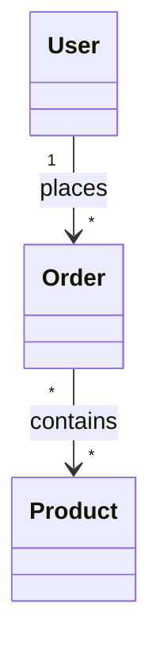

## State Diagrams

**Basic states:**
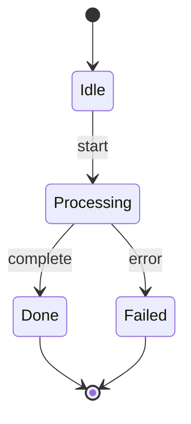

**Nested states:**
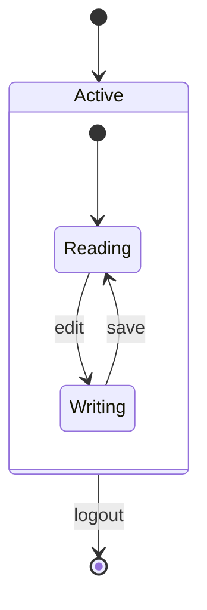

## Gantt Charts

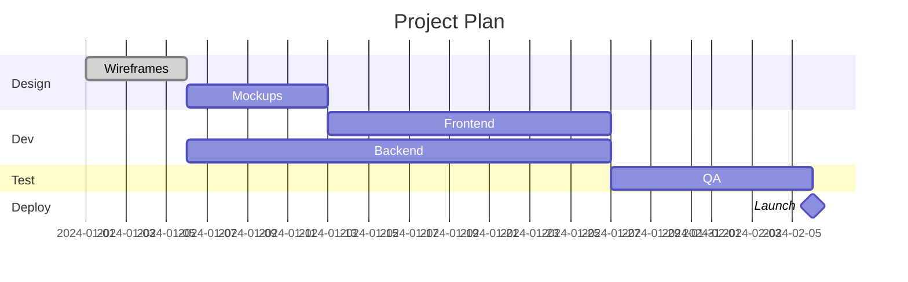

**Task modifiers:** `done`, `active`, `crit`, `milestone`

## Git Graphs

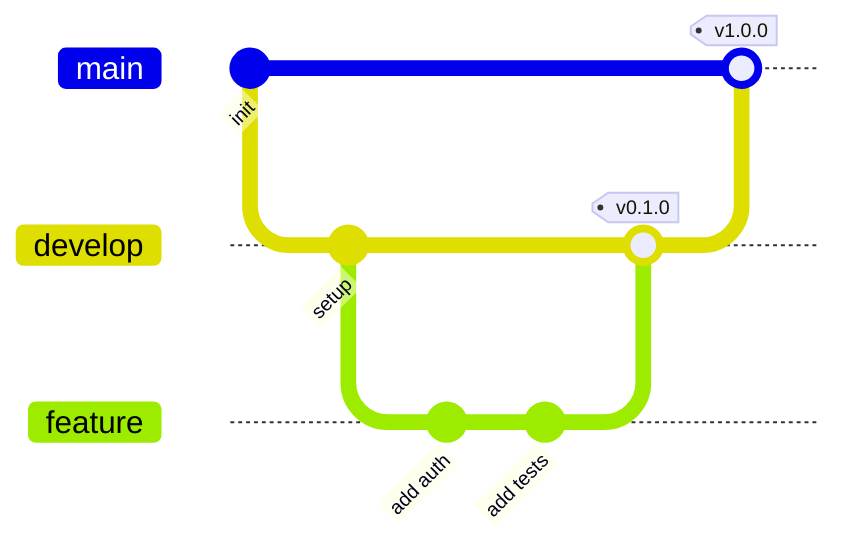

## Block Diagrams

```mermaid
block-beta
    columns 3

    block:Frontend["Frontend"]
        Web[Web App]
        Mobile[Mobile]
    end

    block:Backend["Backend"]
        API[API Server]
        Auth[Auth Service]
    end

    block:Data["Data Layer"]
        db[(Database)]
        cache[(Cache)]
    end

    Frontend --> Backend
    Backend --> Data
```

## Themes

**Via init directive:**
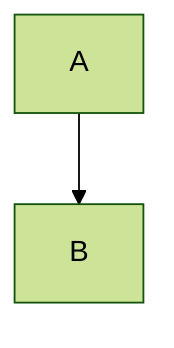

Built-in themes: `default`, `neutral`, `dark`, `forest`, `base`

## Troubleshooting

| Problem | Fix |
|---------|-----|
| Diagram not rendering | Check language identifier is `mermaid`; verify no tab characters (use spaces) |
| Syntax error on special chars | Wrap labels in quotes: `A["Label with (parens)"]` |
| Node ID conflicts | Use unique IDs; avoid reserved words (`end`, `graph`, `subgraph`) |
| Subgraph links fail | Link to nodes inside subgraphs, not to the subgraph ID itself |
| Labels cut off | Keep labels concise; use `\n` for line breaks in labels |
| Direction ignored | Ensure direction keyword (`TD`, `LR`) is on the same line as `flowchart` |
