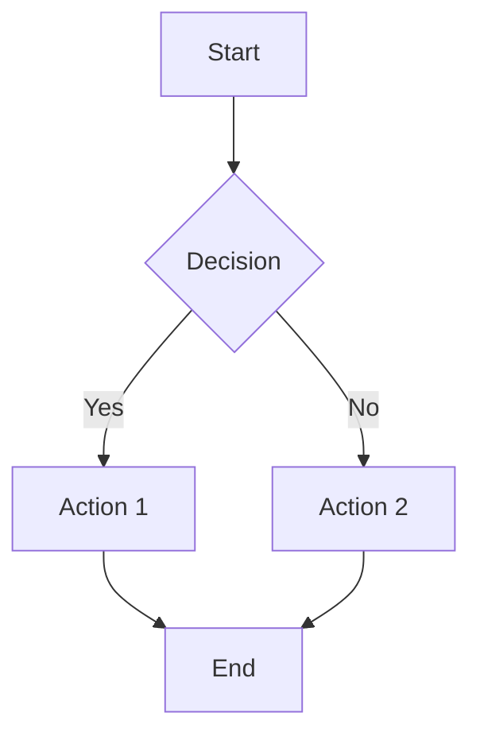
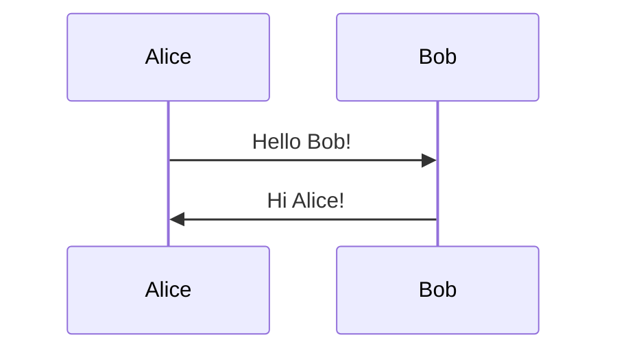
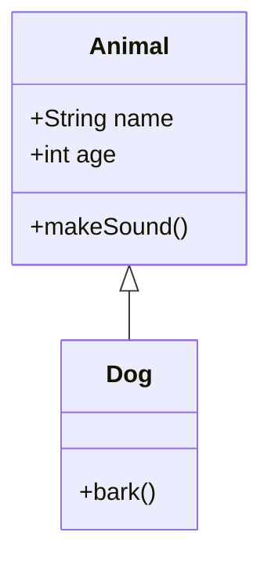
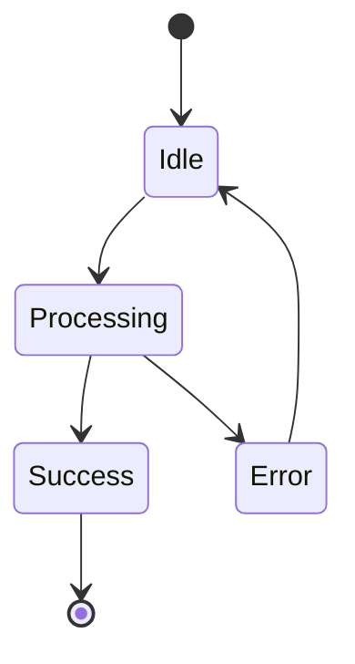
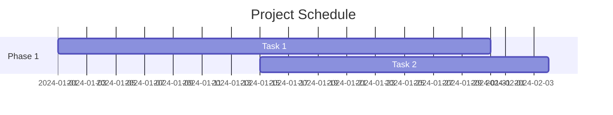
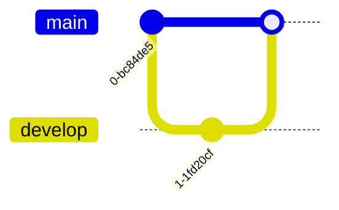
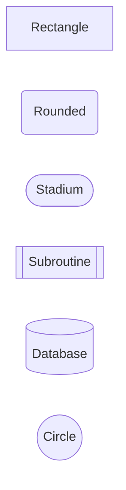
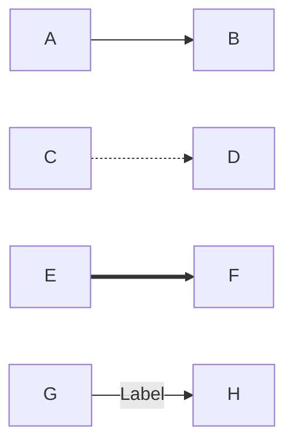
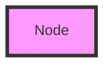

# Mermaid Expert

Expert guidance for Mermaid.js diagramming library.

## Overview

Mermaid Expert provides comprehensive guidance for Mermaid.js, the powerful JavaScript library for creating diagrams and visualizations using text-based syntax. Transform simple text descriptions into professional-looking diagrams that can be embedded in documentation, presentations, and web applications.

## Features

- 📊 **Multiple Diagram Types** - Flowcharts, sequence, class, state, Gantt, and more
- 📝 **Text-Based Syntax** - Easy to write and version control
- 🎨 **Customizable Styling** - Themes and custom CSS
- 🔄 **Live Rendering** - Real-time preview in supported editors
- 📚 **Documentation Ready** - Perfect for README files and docs

## Supported Diagram Types

### Flowcharts
Visualize processes and workflows:



### Sequence Diagrams
Show interactions between components:



### Class Diagrams
Represent object-oriented structures:



### State Diagrams
Model state machines:



### Gantt Charts
Plan project timelines:



### Git Graphs
Visualize Git workflows:



## Usage

Ask for help with any diagram type:

```
Create a flowchart showing the user authentication process
```

```
I need a sequence diagram for API communication
```

```
Show me how to make a Gantt chart in Mermaid
```

## Basic Syntax

### Flowchart Nodes



### Flowchart Arrows



### Styling



## Best Practices

- Use descriptive node labels
- Keep diagrams focused and not too complex
- Use consistent naming conventions
- Add comments for complex logic
- Choose appropriate diagram types
- Test rendering in target environment

## Integration

Mermaid works with:
- GitHub/GitLab Markdown
- VS Code (with extensions)
- Documentation generators (VitePress, Docusaurus)
- Notion, Obsidian
- Custom web applications

## Configuration

```javascript
mermaid.initialize({
  theme: 'default',
  startOnLoad: true,
  flowchart: {
    useMaxWidth: true,
    htmlLabels: true,
    curve: 'basis'
  }
});
```

## Themes

- `default` - Standard theme
- `dark` - Dark mode
- `forest` - Green theme
- `neutral` - Minimal styling

## Common Use Cases

- System architecture diagrams
- User flow documentation
- Database schema visualization
- Project planning
- Process documentation
- API interaction flows

## Requirements

- Modern web browser
- Markdown renderer with Mermaid support (for docs)
- No installation needed for basic use

## Resources

- Official Mermaid documentation
- Live editor: mermaid.live
- Syntax reference
- Example gallery

## Version

Based on Mermaid v11.12.1

## License

MIT
