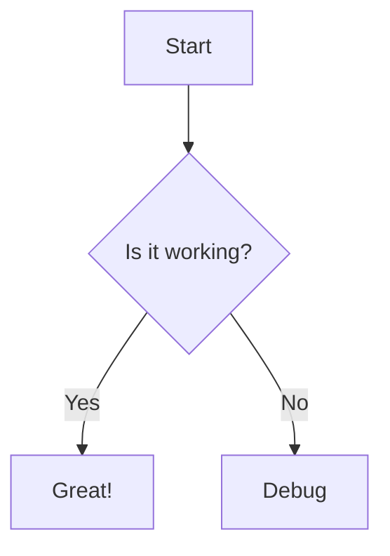

# Obsidian Flavored Markdown

A Reference Guide to Obsidian's Markdown Syntax.

## Basics

Standard Markdown syntax is fully supported:

- **Headers**: `# H1`, `## H2`, `### H3`...
- **Emphasis**: `*italic*`, `**bold**`, `***bold italic***`, `==highlight==`
- **Lists**: `- Item`, `1. Ordered Item`, `- [ ] Task`
- **Quotes**: `> Blockquote`

## Wikilinks

The core of Obsidian's linking system.

- **Link to file**: `[[My Note]]`
- **Link with alias**: `[[My Note|Custom Text]]`
- **Link to heading**: `[[My Note#Heading]]`
- **Link to block**: `[[My Note#^blockid]]`

## Embeds

Embed content from other files directly into the current note.

- **Embed note**: `![[My Note]]`
- **Embed heading**: `![[My Note#Heading]]`
- **Embed image**: `![[image.png]]`
- **Embed PDF**: `![[document.pdf]]`

## Callouts

Obsidian supports GitHub-style admonitions/callouts.

```markdown
> [!info] Title (Optional)
> Content...
```

**Supported Types:**
- `note`, `info`, `todo` (Blue)
- `tip`, `hint`, `important` (Cyan)
- `success`, `check`, `done` (Green)
- `question`, `help`, `faq` (Yellow)
- `warning`, `caution`, `attention` (Orange)
- `failure`, `fail`, `missing` (Red)
- `danger`, `error`, `bug` (Red)
- `example` (Purple)
- `quote`, `cite` (Gray)

**Collapsible Callouts:**
- `> [!info]-` : Folded by default
- `> [!info]+` : Unfolded by default

## Properties (YAML Frontmatter)

Metadata at the top of the file.

```yaml
---
tags: [project, active]
status: In Progress
priority: High
created: 2023-10-27
---
```

## Internal Links in Properties

You can use wikilinks in properties, but they must be quoted:

```yaml
related: "[[Another Note]]"
```

## Comments

- **Inline comments**: `%% This is a comment %%`
- **Block comments**:
  ```markdown
  %%
  Multi-line
  comment
  %%
  ```

## Math (LaTeX)

- **Inline**: `$E=mc^2$`
- **Block**:
  ```latex
  \int_0^\infty e^{-x^2} dx = \frac{\sqrt{\pi}}{2}
  ```

## Diagrams (Mermaid)



## Footnotes

Here is a footnote reference.[^1]

[^1]: This is the footnote text.
