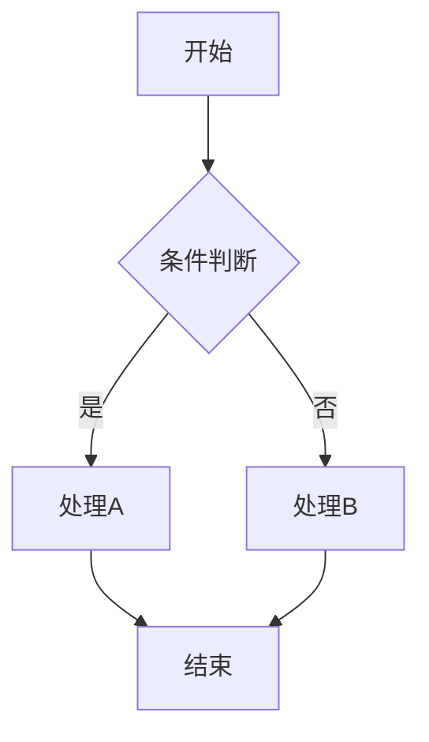
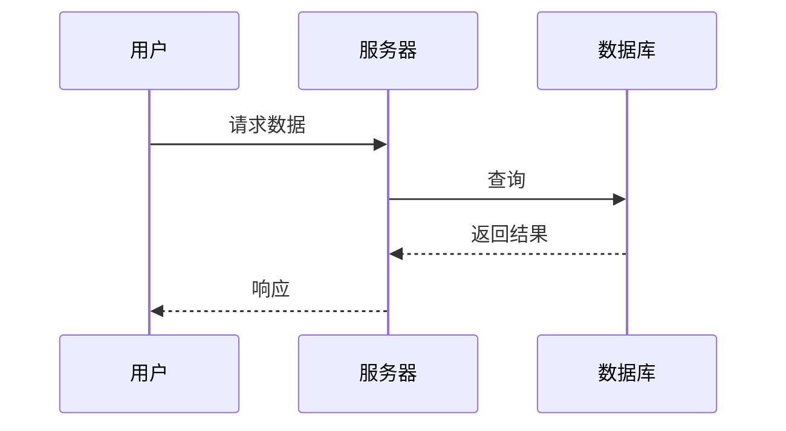
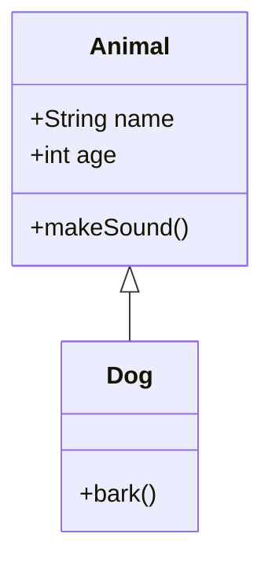
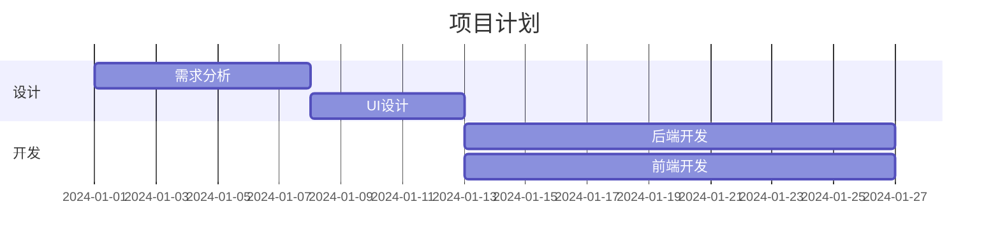
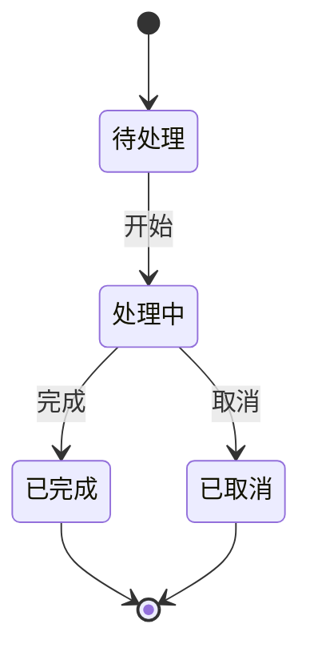
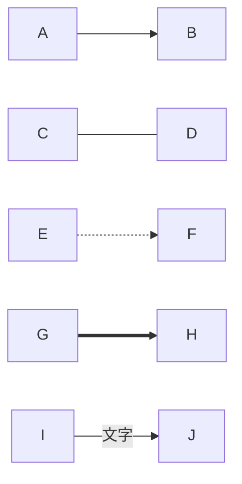

# mermaid-expert

Mermaid.js 图表专家指导。

## 概述

Mermaid Expert 提供 Mermaid.js 图表语言的专家级指导。Mermaid 是一种基于 Markdown 的图表定义语言，可以在文档中直接渲染流程图、时序图、类图等。

## 图表类型

### 流程图

### 时序图

### 类图

### 甘特图

### 状态图

## 图表样式

### 节点样式

### 连线样式

## 主题配置

可用主题：
- `default` - 默认主题
- `dark` - 暗色主题
- `forest` - 绿色主题
- `neutral` - 中性主题

## 最佳实践

1. **选择合适的图表类型** - 根据内容选择最佳呈现方式
2. **保持简洁** - 避免过于复杂的图表
3. **使用有意义的标签** - 清晰描述节点和连线
4. **适当分组** - 使用子图组织相关元素
5. **测试渲染** - 确保在目标平台正确显示

## 集成支持

| 平台 | 支持状态 |
|------|----------|
| GitHub | ✅ |
| GitLab | ✅ |
| Notion | ✅ |
| VitePress | ✅ |
| VS Code | ✅ (扩展) |

## 相关资源

- [Mermaid 官方文档](https://mermaid.js.org/)
- [Mermaid Live Editor](https://mermaid.live/)
