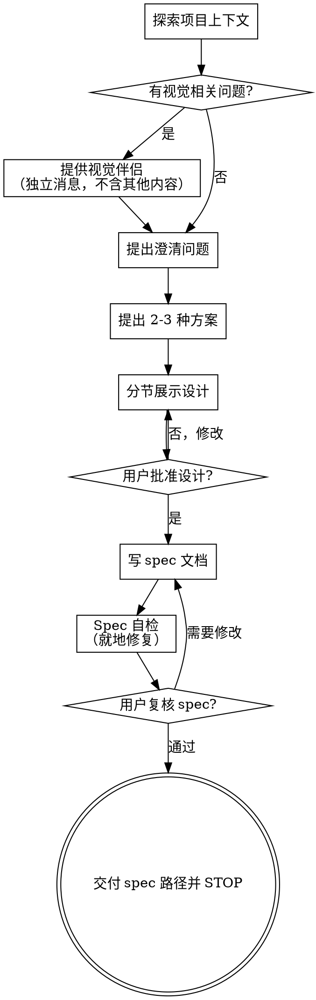

# 头脑风暴：将想法转化为设计与 Spec

通过自然的协作对话，帮助将想法转化为完整的设计与 spec 文档。

首先了解当前项目的上下文，然后逐一提问来完善想法。一旦理解了要构建的内容，就展示设计方案并获得用户批准，再把验证过的 spec 落盘。

<HARD-GATE>
在展示设计方案并获得用户批准之前，不要调用任何实现类技能，不要写代码，不要搭建任何项目，不要采取任何实现行动。这适用于所有项目，无论看起来多简单。
</HARD-GATE>

## 反模式："这个太简单了，不需要设计"

每个项目都要经过这个流程。一个待办事项列表、一个单函数工具、一个配置变更——全都需要。"简单"的项目恰恰是未经检验的假设造成最多浪费的地方。设计可以很简短（真正简单的项目几句话就够了），但必须展示出来并获得批准。

## 检查清单

为以下每一项创建一个任务，并按顺序完成：

1. **探索项目上下文** — 检查文件、文档、最近的 commit
2. **提供视觉伴侣**（如果主题涉及视觉问题）— 这是一条独立的消息，不要与澄清问题合并。参见下方的"视觉伴侣"部分。
3. **提出澄清问题** — 每次一个，了解目的/约束/成功标准
4. **提出 2-3 种方案** — 附带权衡分析和你的推荐
5. **展示设计** — 按复杂度分节展示，每节展示后获得用户批准
6. **写 spec 文档** — 保存到 `.brainstorm/YYYY-MM-DD-<topic>-design.md` 并提交 git
7. **Spec 自检** — 快速自查占位符、矛盾、歧义、范围（详见下方）
8. **用户复核 spec** — 请用户在继续前审阅 spec 文件
9. **交付 spec 路径给用户并 STOP** — 报告 spec 文件路径；不调用任何其他技能，不开始实现

## 流程图

**终态是把 spec 路径交付给用户并 STOP。** 不要调用其他技能，不要开始实现规划，不要写代码。报告 spec 路径并结束你的回合——后续怎么用 spec，由用户自己决定。

## 流程详述

**理解想法：**

- 首先查看当前项目状态（文件、文档、最近的 commit）
- 在提出详细问题之前，先评估范围：如果需求描述了多个独立子系统（例如"构建一个包含聊天、文件存储、计费和分析的平台"），立即指出这一点。不要花时间用问题去细化一个需要先拆分的项目。
- 如果项目规模过大，无法用一份 spec 涵盖，帮助用户分解为子项目：有哪些独立的部分，它们之间有什么关系，应该按什么顺序构建？然后对第一个子项目进入正常的设计流程。每个子项目各自走 spec → plan → 实现 的循环。
- 对于范围适当的项目，每次提一个问题来完善想法
- 尽量使用选择题，开放式问题也可以
- 每条消息只提一个问题——如果一个主题需要更多探索，拆分成多个问题
- 重点理解：目的、约束、成功标准

**探索方案：**

- 提出 2-3 种不同的方案及其权衡
- 以对话的方式展示选项，附上推荐和理由
- 先展示推荐的方案并解释原因

**展示设计：**

- 一旦理解了要构建的内容，就展示设计
- 每个部分的篇幅与其复杂度匹配：简单的几句话，复杂的最多 200-300 字
- 每个部分展示后询问是否正确
- 涵盖：架构、组件、数据流、错误处理、测试
- 随时准备回头澄清不明确的地方

**面向隔离和清晰的设计：**

- 将系统拆分为更小的单元，每个单元有一个明确的职责，通过定义良好的接口通信，可以独立理解和测试
- 对于每个单元，应该能回答：它做什么，如何使用，它依赖什么？
- 别人能否不看内部实现就理解一个单元的功能？能否在不影响调用者的情况下修改内部实现？如果不能，边界需要调整。
- 更小、边界清晰的单元更便于工作——一次能放入上下文的代码推理更准确，文件越专注编辑越可靠。当文件变大时，通常意味着它承担了过多职责。

**在现有代码库中工作：**

- 在提出更改之前先探索现有结构。遵循现有模式。
- 如果现有代码存在影响当前工作的问题（例如文件过大、边界不清、职责纠缠），在设计中包含有针对性的改进——像一个优秀的开发者在工作中改进经手的代码一样。
- 不要提议无关的重构。专注于服务当前目标的事情。

## 设计之后

**写文档：**

- 把通过的设计（spec）写入 `.brainstorm/YYYY-MM-DD-<topic>-design.md`
  - （用户对 spec 位置的偏好覆盖此默认值）
- 把 spec 文档提交到 git

**Spec 自检：**
写完 spec 后，用新鲜的眼光再看一遍：

1. **占位符扫描：** 是否有 "TBD"、"TODO"、未完成的章节或模糊的需求？修掉它们。
2. **内部一致性：** 各章节之间是否互相矛盾？架构描述与功能描述是否一致？
3. **范围检查：** 是否聚焦到可以一次实现规划覆盖的程度，还是需要继续拆分？
4. **歧义检查：** 是否有需求可能被两种方式理解？如有，选定一种并写清楚。

发现问题就地修复。修完即可，不需要再次复核。

**用户复核闸门：**
spec 自检通过后，请用户在继续之前审阅 spec 文件：

> "Spec 已经写入并提交到 `<path>`。请你审阅一下，看是否需要修改，然后我们再考虑下一步。"

等待用户回复。如果他们要求修改，改完后再走一次 spec 自检。只有用户批准后才进入下一步。

**完成——在此 STOP：**

- 把 spec 文件路径报告给用户，然后结束你的回合。
- 不要调用任何其他技能。
- 不要开始实现规划，不要写代码。
- 后续如何处理 spec，由用户自己决定。

## 核心原则

- **每次一个问题** — 不要同时抛出多个问题
- **优先选择题** — 在可能的情况下比开放式问题更容易回答
- **严格遵循 YAGNI** — 从所有设计中移除不必要的功能
- **探索替代方案** — 在做决定之前始终提出 2-3 种方案
- **增量验证** — 展示设计，获得批准后再继续
- **保持灵活** — 有不明确的地方就回头澄清

## 视觉伴侣

一个基于浏览器的伴侣工具，用于在头脑风暴过程中展示原型、图表和视觉选项。它是一个工具——不是一种模式。接受伴侣意味着它可用于适合视觉呈现的问题；并不意味着每个问题都要通过浏览器。

**提供伴侣：** 当预计后续问题会涉及视觉内容（原型、布局、图表）时，提供一次以获得同意：
> "我们接下来讨论的一些内容，如果能在浏览器中展示给你看可能会更直观。我可以在讨论过程中为你制作原型、图表、对比图和其他视觉材料。这个功能还比较新，可能会消耗较多 token。要试试吗？（需要打开一个本地 URL）"

**此提议必须是一条独立的消息。** 不要将它与澄清问题、上下文摘要或任何其他内容合并。消息中应该只包含上述提议，没有其他内容。等待用户回复后再继续。如果他们拒绝，继续纯文本的头脑风暴。

**逐问题决策：** 即使用户接受了，也要对每个问题单独决定是使用浏览器还是终端。判断标准：**用户看到它是否比读到它更容易理解？**

- **使用浏览器** 展示本身就是视觉的内容——原型、线框图、布局对比、架构图、并排视觉设计
- **使用终端** 展示文本内容——需求问题、概念选择、权衡列表、A/B/C/D 文字选项、范围决策

关于 UI 主题的问题不一定是视觉问题。"在这个上下文中个性化是什么意思？"是一个概念问题——使用终端。"哪种向导布局更好？"是一个视觉问题——使用浏览器。

如果用户同意使用伴侣，在继续之前阅读详细指南：
`visual-companion.md`
