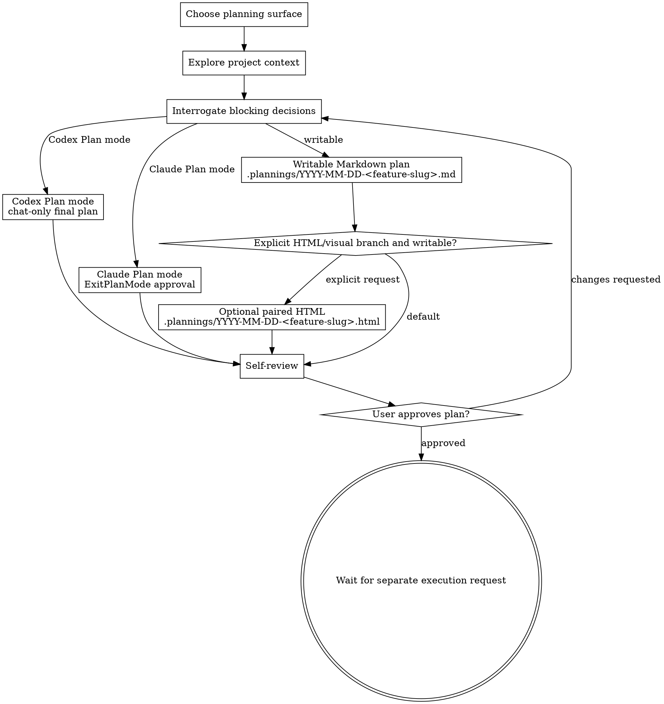

# Brainstorming Ideas Into Approved Plans

Turn rough ideas into an approved implementation plan. Spark is a planning skill, not an execution skill: it clarifies intent, records assumptions, uses the active planning surface correctly, and stops for user approval.

Writable/default output is a Markdown plan at `<project-root>/.plannings/YYYY-MM-DD-<feature-slug>.md`. Native Plan modes are read-only while active. Create an HTML or visual artifact only when the user explicitly asks for HTML, browser-viewable, visual, mockup, or comparable output and the current surface allows file writes.

<HARD-GATE>
Do NOT write production code, scaffold projects, modify implementation files, or invoke implementation workflows while Spark is active. Spark ends at an approved plan and waits for a separate execution request.
</HARD-GATE>

## Planning Surface Selection

Choose the planning surface before deriving an output path. Do not force-enter Codex Plan mode just to run Spark; the user controls Codex native Plan mode with the client UI such as `/plan` or its mode toggle. Claude Code Plan mode may expose explicit plan-mode tools; use those only in the Claude Code branch.

| Surface | Use when | Output | File-write rule |
| --- | --- | --- | --- |
| **Codex native Plan mode** | The Codex session is already in Plan mode. | Final plan in chat only. Use `request_user_input` when available for one blocking structured question; otherwise ask one concise plain-text question. | Read-only. Do not derive or write `.plannings`, `.spark`, HTML, `CONTEXT.md`, ADR, task, or implementation files. |
| **Claude Code Plan mode** | The Claude Code session is in Plan mode, or Claude Code exposes native Plan mode tools for this workflow. | Submit the plan through Claude's approval flow. Use `EnterPlanMode`/`ExitPlanMode` when those tools are available. | Do not write files while Plan mode is active. After `ExitPlanMode` approval exits Plan mode into a writable permission mode, materialize the approved Spark plan if durable output was requested, then stop. |
| **Writable/default mode** | No native Plan mode is active and file writes are allowed. | Markdown plan in `.plannings/YYYY-MM-DD-<feature-slug>.md`; optional paired HTML/visual only on explicit request. | File writes are limited to the planning artifacts described below. Do not modify production files. |
| **Compatibility fallback** | No native plan surface or structured question tool is available. | Use the `writing-plans` planning method only as a fallback rubric. | If file writes are allowed, use writable/default mode. If file writes are not allowed, return a chat-only plan and say no artifact was saved. |

## Checklist

Track each item and complete them in order:

1. **Choose the planning surface** — determine whether Spark is in Codex native Plan mode, Claude Code Plan mode, writable/default mode, or compatibility fallback.
2. **Explore project context** — inspect the relevant files, docs, existing plans, and repo guidance before proposing changes.
3. **Interrogate only blocking decisions** — clarify only decisions that would materially change the plan. Ask one blocking question at a time; use the active structured question tool when available (`request_user_input` in Codex Plan mode, `AskUserQuestion` in compatible Claude-style environments), otherwise ask one concise plain-text question. Record non-blocking unknowns as assumptions instead of stopping.
4. **Choose the artifact branch** — in writable/default mode, default to Markdown. Enter the explicit HTML/visual branch only when the user asked for HTML, browser-viewable output, visual specs, mockups, or layout comparisons. In active Plan modes, record those artifact requests as follow-ups.
5. **Derive the plan path only when writable** — save the Markdown plan to `<project-root>/.plannings/YYYY-MM-DD-<feature-slug>.md` only in writable/default mode, or after Claude Code `ExitPlanMode` approval has exited into a writable permission mode.
6. **Generate the plan** — produce the complete plan in the selected surface with concrete implementation steps and verification criteria.
7. **Optional explicit HTML/visual artifact** — only when writable and explicitly requested, save a paired HTML artifact to `<project-root>/.plannings/YYYY-MM-DD-<feature-slug>.html` and follow the offline HTML contract.
8. **Self-review** — check the plan for placeholders, contradictions, missing acceptance criteria, hidden assumptions, overscope, and implementation leakage.
9. **User approval gate** — report the chat plan or plan path, summarize the decision, ask for approval or changes, then wait. Do not begin implementation.

## Process Flow



## The Process

**Understanding the idea:**

- Start from the current project state: local guidance files, existing architecture, pending plans, tests, and recent decisions that affect the requested work.
- Look for domain documents before asking: `AGENTS.md`, `code_map.md`, existing `.plannings/` plans, task PRDs, `CONTEXT.md`, `CONTEXT-MAP.md`, `docs/adr/`, package ADR folders, relevant code, tests, configs, and fixtures.
- If the brief spans multiple independent subsystems, say so early and split the plan into sequenced phases rather than pretending one plan can cover everything equally.
- Ask only for missing information that changes scope, architecture, acceptance criteria, or risk. For all other gaps, choose a sensible assumption and mark it clearly in the plan.
- Focus on purpose, constraints, success criteria, non-goals, compatibility requirements, and verification gates.

**Decision-tree interrogation:**

- Build an internal queue of unresolved decisions: goal, actor, workflow owner, input/output contract, state lifecycle, terminology, compatibility, migration, failure modes, acceptance tests, artifact surface, and platform surface.
- Ask exactly one blocking question at a time and wait for the answer before continuing.
- Each blocking question must include the decision needed, why it matters, Spark's recommended answer, and the trade-off if the user chooses differently. Use 2-4 mutually exclusive options when a structured question tool is available.
- If a question can be answered by exploring the codebase or docs, explore instead of asking.
- Challenge glossary conflicts immediately. If `CONTEXT.md` defines a term differently from the user's wording, name the mismatch and ask which meaning governs the plan.
- Split overloaded or fuzzy terms into precise alternatives, then recommend the canonical term that best matches the project.
- Stress-test ambiguous requirements with concrete scenarios and edge cases.
- Cross-check user claims against code and docs. If they contradict each other, surface the contradiction before planning around either version.
- In active Plan modes, propose glossary, ADR, `CONTEXT.md`, or task-file updates as follow-up actions in the final plan. Do not edit those files until the session exits Plan mode into a writable request.

**Exploring approaches:**

- Compare 2-3 plausible approaches in your reasoning.
- Surface an approach choice to the user only when the choice would materially change the plan; otherwise select the best approach and record rejected alternatives in the plan.
- Keep the plan implementation-oriented: name the files or areas likely to change, the sequence, risk controls, and the tests that will prove completion.

**Design for isolation and clarity:**

- Break work into small units with clear ownership and interfaces.
- Prefer existing project patterns and utilities before proposing new abstractions or dependencies.
- Include targeted cleanup only when it directly supports the requested work.

## Writable Output Path and Slug Rules

The Markdown plan path in writable/default mode is:

`<project-root>/.plannings/YYYY-MM-DD-<feature-slug>.md`

Skip this path entirely in Codex native Plan mode. In Claude Code Plan mode, derive and write this path only after `ExitPlanMode` approval has exited Plan mode into a writable permission mode.

Rules:

- Use the project root from the current repository or workspace.
- Use the local calendar date in `YYYY-MM-DD` format.
- Derive `<feature-slug>` from the feature name when one is obvious.
- Convert the slug to lowercase kebab-case: ASCII letters/numbers separated by single hyphens.
- Drop filler words and punctuation; collapse repeated hyphens.
- If no feature name is obvious, create a short slug from the user's brief.
- If a file with the same name already exists, append a short differentiator such as `-v2` or a more specific noun.
- Do not create or edit `.gitignore`; `.plannings/` is the expected local planning area.

## Markdown Plan Structure

Use this structure unless the repository already has a stronger plan template:

```markdown
# <Feature Name> Implementation Plan

- Date: YYYY-MM-DD
- Feature slug: <feature-slug>
- Status: Draft for user review

## Summary

## Goals

## Non-goals

## Current context

## Assumptions

## Recommended approach

## Alternatives considered

## Implementation steps

## Files and areas likely to change

## Risks and mitigations

## Test and acceptance criteria

## Approval gate
```

Implementation steps should be concrete enough that a fresh agent can execute them without redesigning the feature. Acceptance criteria must name observable checks, commands, or behaviors; avoid vague wording such as "confirm it works".

## Plan Mode Output Structure

When Spark is in Codex native Plan mode, end with a chat-only final plan containing:

- Summary
- Resolved decisions
- Assumptions
- Recommended approach
- Rejected alternatives
- Implementation steps
- Files and areas likely to change
- Risks and mitigations
- Test and acceptance criteria
- Follow-up file artifacts to create after leaving Plan mode

When Spark is in Claude Code Plan mode, submit the plan through the Claude Code approval flow with `ExitPlanMode` when available. If approval exits Plan mode into a writable permission mode and the user wanted durable Spark output, then write the approved Markdown plan under `.plannings/` and stop. If the user does not approve, do not write an artifact.

## Explicit HTML/Visual Branch

Only create a `.html` artifact when the user explicitly requests HTML, a browser-viewable plan/spec, visual output, mockups, layout comparisons, or a similar visual deliverable.

This branch is unavailable while Codex native Plan mode or Claude Code Plan mode is active because the visual companion and HTML branch write files. In active Plan modes, list the requested HTML/visual artifact as a follow-up to create after leaving Plan mode.

When the explicit branch is active:

- Keep the Markdown plan as the source of truth.
- Save the HTML artifact beside it as `<project-root>/.plannings/YYYY-MM-DD-<feature-slug>.html`.
- Build from `assets/spec-template.html` when a full HTML plan/spec is needed.
- Keep the HTML offline and self-contained: inline CSS, no remote scripts, stylesheets, fonts, images, iframes, or protocol-relative URLs.
- Use semantic HTML with exactly one `h1`, a `main id="main"`, and clear headings.
- Leave no unresolved template placeholders such as TODO, TBD, `[placeholder]`, or lorem ipsum.
- Use `spec-document-reviewer-prompt.md` only for this HTML branch; the default Markdown plan uses the Markdown self-review below.
- For interactive visual questions, read `visual-companion.md` before starting the browser companion. Visual companion scratch files are separate from the default plan output.

## Self-Review

Before asking for approval, review the generated plan and fix issues inline:

1. **Placeholder scan:** remove TODO, TBD, bracket placeholders, lorem ipsum, and incomplete bullets.
2. **Consistency:** ensure goals, approach, steps, risks, and tests do not contradict each other.
3. **Scope:** confirm the plan is small enough to execute as one coherent task or clearly split into phases.
4. **Assumptions:** mark assumptions explicitly and avoid hiding uncertain requirements inside implementation steps.
5. **Verification:** ensure every important behavior has a concrete test, command, or acceptance check.
6. **No execution leakage:** confirm no implementation files were changed and no execution workflow was invoked.
7. **Plan mode boundary:** confirm no `.plannings`, `.spark`, HTML, `CONTEXT.md`, ADR, task, or implementation file writes were performed while Codex native Plan mode or Claude Code Plan mode was active.

## User Approval Gate

After self-review, respond with:

- The chat-only plan if running in Codex native Plan mode.
- The Claude Code plan approval state if running in Claude Code Plan mode.
- The Markdown plan path when a writable artifact was created.
- The optional HTML path, only if created.
- A short summary of the recommended approach and main risks.
- A clear request for approval or requested changes.

Then stop. Do not implement until the user separately asks to execute the approved plan.

## Key Principles

- **Surface before artifact** — choose Codex Plan mode, Claude Code Plan mode, writable/default mode, or fallback before deciding whether any file can be written.
- **Markdown when writable** — Spark produces a durable implementation plan in `.plannings/` only when the current surface allows file writes; HTML is opt-in.
- **Ask only what blocks the plan** — prefer explicit assumptions over unnecessary interview rounds.
- **Evidence before planning** — inspect the local project before recommending file-level changes.
- **Grill with evidence** — challenge terminology, concrete scenarios, hidden assumptions, and code/docs contradictions before locking the plan.
- **YAGNI ruthlessly** — remove unrequested features and broad refactors.
- **Plan for verification** — every plan needs concrete tests or checks.
- **Wait after approval** — approval completes Spark; execution is a separate user request.

## Visual Companion

The browser-based companion is available only for explicit visual planning needs in writable/default mode. Use it for mockups, diagrams, layout comparisons, and other genuinely visual choices. Keep textual requirements, scope decisions, and technical tradeoffs in the terminal.

Before starting the companion, read the detailed guide:
`visual-companion.md`
