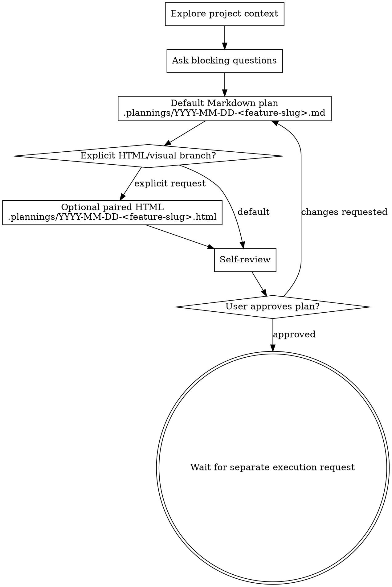

# Brainstorming Ideas Into Markdown Plans

Turn rough ideas into an approved implementation plan. Spark is a planning skill, not an execution skill: it clarifies intent, records assumptions, writes a Markdown plan file, and stops for user approval.

Default output is a Markdown plan at `<project-root>/.plannings/YYYY-MM-DD-<feature-slug>.md`. Create an HTML or visual artifact only when the user explicitly asks for HTML, browser-viewable, visual, mockup, or comparable output.

<HARD-GATE>
Do NOT write production code, scaffold projects, modify implementation files, or invoke implementation workflows while Spark is active. Spark ends at an approved plan and waits for a separate execution request.
</HARD-GATE>

## Planning Surface Selection

Prefer the current native plan surface when the environment provides one. Do not force-enter a new mode just to run Spark.

If the environment does not support native plan mode, use the `writing-plans` planning method as the only fallback rubric. When using that fallback, override any default output path and still save Spark's plan to `.plannings/YYYY-MM-DD-<feature-slug>.md`.

## Checklist

Create a task for each item and complete them in order:

1. **Explore project context** — inspect the relevant files, docs, existing plans, and repo guidance before proposing changes.
2. **Ask only blocking questions** — clarify only decisions that would materially change the plan. Use the native structured question tool (`AskUserQuestion`) when available for 2-4 mutually exclusive options; otherwise ask one concise plain-text question. Record non-blocking unknowns as assumptions instead of stopping.
3. **Choose the artifact branch** — default to Markdown. Enter the explicit HTML/visual branch only when the user asked for HTML, browser-viewable output, visual specs, mockups, or layout comparisons.
4. **Derive the plan path** — save the Markdown plan to `<project-root>/.plannings/YYYY-MM-DD-<feature-slug>.md` using the slug rules below.
5. **Generate the Markdown plan** — write the complete plan in one pass with concrete implementation steps and verification criteria.
6. **Optional explicit HTML/visual artifact** — if the explicit branch is active, save a paired HTML artifact to `<project-root>/.plannings/YYYY-MM-DD-<feature-slug>.html` and follow the offline HTML contract.
7. **Self-review** — check the plan for placeholders, contradictions, missing acceptance criteria, hidden assumptions, overscope, and implementation leakage.
8. **User approval gate** — report the plan path (and optional HTML path), summarize the decision, ask for approval or changes, then wait. Do not begin implementation.

## Process Flow



## The Process

**Understanding the idea:**

- Start from the current project state: local guidance files, existing architecture, pending plans, tests, and recent decisions that affect the requested work.
- If the brief spans multiple independent subsystems, say so early and split the plan into sequenced phases rather than pretending one plan can cover everything equally.
- Ask only for missing information that changes scope, architecture, acceptance criteria, or risk. For all other gaps, choose a sensible assumption and mark it clearly in the plan.
- Focus on purpose, constraints, success criteria, non-goals, compatibility requirements, and verification gates.

**Exploring approaches:**

- Compare 2-3 plausible approaches in your reasoning.
- Surface an approach choice to the user only when the choice would materially change the plan; otherwise select the best approach and record rejected alternatives in the plan.
- Keep the plan implementation-oriented: name the files or areas likely to change, the sequence, risk controls, and the tests that will prove completion.

**Design for isolation and clarity:**

- Break work into small units with clear ownership and interfaces.
- Prefer existing project patterns and utilities before proposing new abstractions or dependencies.
- Include targeted cleanup only when it directly supports the requested work.

## Output Path and Slug Rules

The Markdown plan path is always:

`<project-root>/.plannings/YYYY-MM-DD-<feature-slug>.md`

Rules:

- Use the project root from the current repository or workspace.
- Use the local calendar date in `YYYY-MM-DD` format.
- Derive `<feature-slug>` from the feature name when one is obvious.
- Convert the slug to lowercase kebab-case: ASCII letters/numbers separated by single hyphens.
- Drop filler words and punctuation; collapse repeated hyphens.
- If no feature name is obvious, create a short slug from the user's brief.
- If a file with the same name already exists, append a short differentiator such as `-v2` or a more specific noun.
- Do not create or edit `.gitignore`; `.plannings/` is the expected local planning area.

## Markdown Plan Structure

Use this structure unless the repository already has a stronger plan template:

```markdown
# <Feature Name> Implementation Plan

- Date: YYYY-MM-DD
- Feature slug: <feature-slug>
- Status: Draft for user review

## Summary

## Goals

## Non-goals

## Current context

## Assumptions

## Recommended approach

## Alternatives considered

## Implementation steps

## Files and areas likely to change

## Risks and mitigations

## Test and acceptance criteria

## Approval gate
```

Implementation steps should be concrete enough that a fresh agent can execute them without redesigning the feature. Acceptance criteria must name observable checks, commands, or behaviors; avoid vague wording such as "confirm it works".

## Explicit HTML/Visual Branch

Only create a `.html` artifact when the user explicitly requests HTML, a browser-viewable plan/spec, visual output, mockups, layout comparisons, or a similar visual deliverable.

When the explicit branch is active:

- Keep the Markdown plan as the source of truth.
- Save the HTML artifact beside it as `<project-root>/.plannings/YYYY-MM-DD-<feature-slug>.html`.
- Build from `assets/spec-template.html` when a full HTML plan/spec is needed.
- Keep the HTML offline and self-contained: inline CSS, no remote scripts, stylesheets, fonts, images, iframes, or protocol-relative URLs.
- Use semantic HTML with exactly one `h1`, a `main id="main"`, and clear headings.
- Leave no unresolved template placeholders such as TODO, TBD, `[placeholder]`, or lorem ipsum.
- Use `spec-document-reviewer-prompt.md` only for this HTML branch; the default Markdown plan uses the Markdown self-review below.
- For interactive visual questions, read `visual-companion.md` before starting the browser companion. Visual companion scratch files are separate from the default plan output.

## Self-Review

Before asking for approval, review the generated plan and fix issues inline:

1. **Placeholder scan:** remove TODO, TBD, bracket placeholders, lorem ipsum, and incomplete bullets.
2. **Consistency:** ensure goals, approach, steps, risks, and tests do not contradict each other.
3. **Scope:** confirm the plan is small enough to execute as one coherent task or clearly split into phases.
4. **Assumptions:** mark assumptions explicitly and avoid hiding uncertain requirements inside implementation steps.
5. **Verification:** ensure every important behavior has a concrete test, command, or acceptance check.
6. **No execution leakage:** confirm no implementation files were changed and no execution workflow was invoked.

## User Approval Gate

After self-review, respond with:

- The Markdown plan path.
- The optional HTML path, only if created.
- A short summary of the recommended approach and main risks.
- A clear request for approval or requested changes.

Then stop. Do not implement until the user separately asks to execute the approved plan.

## Key Principles

- **Markdown by default** — Spark produces a durable implementation plan first; HTML is opt-in.
- **Ask only what blocks the plan** — prefer explicit assumptions over unnecessary interview rounds.
- **Evidence before planning** — inspect the local project before recommending file-level changes.
- **YAGNI ruthlessly** — remove unrequested features and broad refactors.
- **Plan for verification** — every plan needs concrete tests or checks.
- **Wait after approval** — approval completes Spark; execution is a separate user request.

## Visual Companion

The browser-based companion is available only for explicit visual planning needs. Use it for mockups, diagrams, layout comparisons, and other genuinely visual choices. Keep textual requirements, scope decisions, and technical tradeoffs in the terminal.

Before starting the companion, read the detailed guide:
`visual-companion.md`
