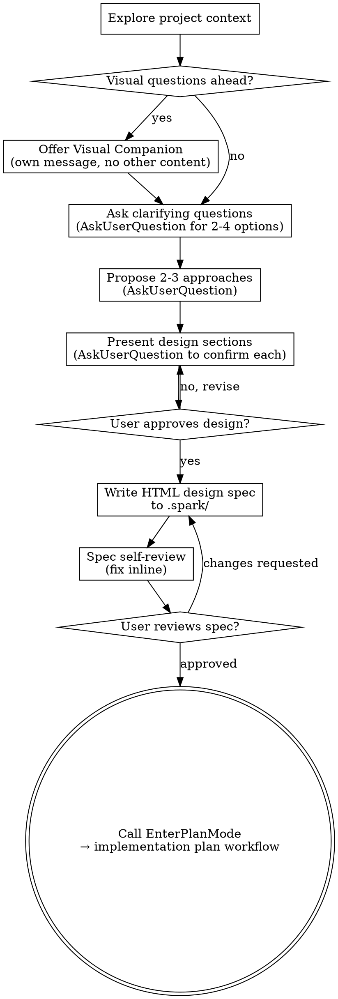

# Brainstorming Ideas Into Designs

Help turn ideas into fully formed designs and specs through natural collaborative dialogue.

Start by understanding the current project context, then ask questions one at a time to refine the idea. Once you understand what you're building, present the design and get user approval.

<HARD-GATE>
Do NOT invoke any implementation skill, write any code, scaffold any project, or take any implementation action until you have presented a design and the user has approved it. This applies to EVERY project regardless of perceived simplicity. The one sanctioned next step after spec approval is calling the `EnterPlanMode` tool to draft the implementation plan — that is the designed handoff, not a violation of this gate.
</HARD-GATE>

## Anti-Pattern: "This Is Too Simple To Need A Design"

Every project goes through this process. A todo list, a single-function utility, a config change — all of them. "Simple" projects are where unexamined assumptions cause the most wasted work. The design can be short (a few sentences for truly simple projects), but you MUST present it and get approval.

## Checklist

You MUST create a task for each of these items and complete them in order:

1. **Explore project context** — check files, docs, recent commits
2. **Offer visual companion** (if topic will involve visual questions) — this is its own message, not combined with a clarifying question. See the Visual Companion section below.
3. **Ask clarifying questions** — one at a time, understand purpose/constraints/success criteria. Use the `AskUserQuestion` tool for any 2-4-option decision; use plain text only for genuinely open-ended prompts.
4. **Propose 2-3 approaches** — present them via `AskUserQuestion` with your recommendation marked "(Recommended)" in the first option
5. **Present design** — in sections scaled to their complexity, confirm each section with `AskUserQuestion` (Looks right / Needs revision / Skip this section)
6. **Write HTML design spec** — save to `<project-root>/.spark/YYYY-MM-DD-<topic>-design.html` (see ".spark/ output directory" below). The file is gitignored working state, not committed source.
7. **Spec self-review** — quick inline check for placeholders, contradictions, ambiguity, scope (see below)
8. **User reviews written spec** — ask user to review the spec file before proceeding
   8b. **Plan-mode pre-check** — if plan mode is already active when spark was invoked, follow "Plan mode already active" below instead of step 9
9. **Hand off to plan mode** — call the `EnterPlanMode` tool and run the implementation-plan workflow using the spec file as the primary requirements input. The user approves the resulting plan via `ExitPlanMode`.

## Process Flow

**After the user approves the HTML spec, call the `EnterPlanMode` tool.** Do NOT write code or modify project files (other than `.gitignore` and the spec file itself), and do NOT invoke any other skill. `EnterPlanMode` hands control to Claude Code's native plan workflow; `ExitPlanMode` is the final user gate before any implementation begins.

## The Process

**Understanding the idea:**

- Check out the current project state first (files, docs, recent commits)
- Before asking detailed questions, assess scope: if the request describes multiple independent subsystems (e.g., "build a platform with chat, file storage, billing, and analytics"), flag this immediately. Don't spend questions refining details of a project that needs to be decomposed first.
- If the project is too large for a single spec, help the user decompose into sub-projects: what are the independent pieces, how do they relate, what order should they be built? Then brainstorm the first sub-project through the normal design flow. Each sub-project gets its own spec → plan → implementation cycle.
- For appropriately-scoped projects, ask questions one at a time to refine the idea
- For decisions that reduce to 2-4 mutually exclusive options (approach choice, scope split, design alternative, in/out of scope), use the `AskUserQuestion` tool — not plain-text questions. It renders a structured picker and is the primary clarification surface in plan mode.
- Use plain-text questions only for genuinely open-ended prompts (free-form context, follow-up clarifications after an `AskUserQuestion` answer)
- Only one question per message — if a topic needs more exploration, break it into multiple questions
- Focus on understanding: purpose, constraints, success criteria

**Exploring approaches:**

- Propose 2-3 different approaches with trade-offs
- Present them via `AskUserQuestion` with one option per approach plus an "Other / discuss" escape hatch
- Lead with your recommended option as the first option and mark it "(Recommended)" in the label; explain why in the question text

**Presenting the design:**

- Once you believe you understand what you're building, present the design
- Scale each section to its complexity: a few sentences if straightforward, up to 200-300 words if nuanced
- After each section, confirm with `AskUserQuestion` offering options like "Looks right", "Needs revision", "Skip this section". Free-form revisions follow as plain text once the user picks "Needs revision".
- Cover: architecture, components, data flow, error handling, testing
- Be ready to go back and clarify if something doesn't make sense

**Design for isolation and clarity:**

- Break the system into smaller units that each have one clear purpose, communicate through well-defined interfaces, and can be understood and tested independently
- For each unit, you should be able to answer: what does it do, how do you use it, and what does it depend on?
- Can someone understand what a unit does without reading its internals? Can you change the internals without breaking consumers? If not, the boundaries need work.
- Smaller, well-bounded units are also easier for you to work with - you reason better about code you can hold in context at once, and your edits are more reliable when files are focused. When a file grows large, that's often a signal that it's doing too much.

**Working in existing codebases:**

- Explore the current structure before proposing changes. Follow existing patterns.
- Where existing code has problems that affect the work (e.g., a file that's grown too large, unclear boundaries, tangled responsibilities), include targeted improvements as part of the design - the way a good developer improves code they're working in.
- Don't propose unrelated refactoring. Stay focused on what serves the current goal.

## After the Design

**Documentation:**

- Write the validated design (spec) to `<project-root>/.spark/YYYY-MM-DD-<topic>-design.html`
  - (User preferences for spec location override this default)
- Build the file from `assets/spec-template.html`: copy the template structure, replace its example content with the confirmed design, and keep the same semantic section order unless the user explicitly requests a different structure.
- Do not commit — `.spark/` is gitignored working state, not committed source. See ".spark/ output directory" below for the `.gitignore` handling.

**HTML Spec Output Contract:**

- Produce one self-contained `.html` file that can be opened offline.
- Use semantic HTML with exactly one `h1`, a `main id="main"`, and clear section headings.
- Keep CSS inline in a `<style>` block; do not load remote scripts, stylesheets, fonts, images, iframes, or protocol-relative URLs.
- Include the standard sections from `assets/spec-template.html`: Summary, Goals, Non-goals, Context, Recommended Approach, Alternatives, Design Details, Risks, Test/Acceptance Criteria, and Review Status.
- Leave no unresolved template placeholders such as TODO, TBD, `[placeholder]`, or lorem ipsum.
- Make it printable and readable without JavaScript; only add inline vanilla JavaScript if the spec genuinely needs progressive disclosure.
- Test/Acceptance Criteria, Risks, and Review Status are rendered as interactive checklists (`<ul class="checklist">` with `<input type="checkbox">` inside `<label>`). They're native HTML — no JavaScript needed for the toggle. Goals, Non-goals, and other descriptive lists remain plain `<ul>`.

**`.spark/` output directory:**

The spec lives at `<project-root>/.spark/YYYY-MM-DD-<topic>-design.html`. `.spark/` is local working state, not committed source. Before the first write of a session, ensure `.spark/` is gitignored:

1. Read the project-root `.gitignore`. If a line exactly matching `.spark/` (or `.spark` / `/.spark/`) is already present, do nothing.
2. If not present, append `.spark/` on its own line (preceded by a newline if the file does not already end with one). Idempotent on re-invocation.
3. If `.gitignore` does not exist, create it containing the single line `.spark/`.

Do NOT `git add` the spec or the directory. Tell the user the spec path; they decide whether to share or archive it. If the user's project conventions reserve `.spark/` for something else, accept their override and use a different gitignored path.

**Spec Self-Review:**
After writing the HTML spec document, look at it with fresh eyes:

1. **Placeholder scan:** Any "TBD", "TODO", bracket placeholders, lorem ipsum, incomplete sections, or vague requirements? Fix them.
2. **Internal consistency:** Do any sections contradict each other? Does the architecture match the feature descriptions?
3. **Scope check:** Is this focused enough for a single implementation plan, or does it need decomposition?
4. **Ambiguity check:** Could any requirement be interpreted two different ways? If so, pick one and make it explicit.

Fix any issues inline. No need to re-review — just fix and move on.

**User Review Gate:**
After the spec review loop passes, ask the user to review the written spec before proceeding:

> "HTML spec written to `<path>`. Please review it and let me know if you want to make any changes before we draft the implementation plan in plan mode."

Wait for the user's response. If they request changes, make them and re-run the spec review loop. Only proceed once the user approves.

**Plan-mode handoff:**

After the user approves the spec, call the `EnterPlanMode` tool. Open with a brief message such as: "Drafting the implementation plan from the spec at `<spec-path>`. I'll surface the plan for your approval before any code is written."

Inside plan mode:

- Treat the spec file as the primary requirements input.
- Run the standard Phase 1-5 plan workflow that plan mode prescribes (explore the relevant code, design, file-by-file changes, risks, verification).
- Write the plan to the plan file path that plan mode provides — do not hardcode a location.
- The user approves the plan via `ExitPlanMode`. Implementation begins only after that.

Hard constraints:

- Do NOT invoke any other skill from the spark workflow (`writing-plans`, `executing-plans`, `subagent-driven-development`, etc.). `EnterPlanMode` is the only sanctioned handoff.
- If the user declines the plan-mode step ("just the spec is enough", "I'll plan it myself"), report the spec path and end the turn. This preserves the old terminal behavior as an explicit opt-out.

**Plan mode already active:**

If plan mode is already active when spark is invoked (you see plan-mode system reminders in context, or you cannot write files outside the plan file), do NOT call `EnterPlanMode` again and do NOT attempt the spec file write — the harness will block it.

Instead:

1. Run the entire dialogue (clarifying questions, approach selection, section-by-section design) in conversation, using `AskUserQuestion` as usual.
2. When the user approves the design, ask via `AskUserQuestion` whether to:
   - **Exit plan mode now** — so spark can write the HTML spec to `.spark/`, then re-enter plan mode for the implementation plan, OR
   - **Skip the HTML artifact** — proceed directly to drafting the implementation plan inline (the design lives in conversation history only)
3. Honor the user's choice. The "skip artifact" branch keeps everything inside the current plan-mode session.

Rationale: file writes outside the plan file are blocked in plan mode; surfacing the choice keeps the user in control rather than failing silently.

## Key Principles

- **One question at a time** - Don't overwhelm with multiple questions
- **Multiple choice preferred** - Easier to answer than open-ended when possible
- **YAGNI ruthlessly** - Remove unnecessary features from all designs
- **Explore alternatives** - Always propose 2-3 approaches before settling
- **Incremental validation** - Present design, get approval before moving on
- **Be flexible** - Go back and clarify when something doesn't make sense

## Visual Companion

A browser-based companion for showing mockups, diagrams, and visual options during brainstorming. Available as a tool — not a mode. Accepting the companion means it's available for questions that benefit from visual treatment; it does NOT mean every question goes through the browser.

**Offering the companion:** When you anticipate that upcoming questions will involve visual content (mockups, layouts, diagrams), offer it once for consent:

> "Some of what we're working on might be easier to explain if I can show it to you in a web browser. I can put together mockups, diagrams, comparisons, and other visuals as we go. This feature is still new and can be token-intensive. Want to try it? (Requires opening a local URL)"

**This offer MUST be its own message.** Do not combine it with clarifying questions, context summaries, or any other content. The message should contain ONLY the offer above and nothing else. Wait for the user's response before continuing. If they decline, proceed with text-only brainstorming.

**Per-question decision:** Even after the user accepts, decide FOR EACH QUESTION whether to use the browser or the terminal. The test: **would the user understand this better by seeing it than reading it?**

- **Use the browser** for content that IS visual — mockups, wireframes, layout comparisons, architecture diagrams, side-by-side visual designs
- **Use the terminal** for content that is text — requirements questions, conceptual choices, tradeoff lists, A/B/C/D text options, scope decisions

A question about a UI topic is not automatically a visual question. "What does personality mean in this context?" is a conceptual question — use the terminal. "Which wizard layout works better?" is a visual question — use the browser.

If they agree to the companion, read the detailed guide before proceeding:
`visual-companion.md`
