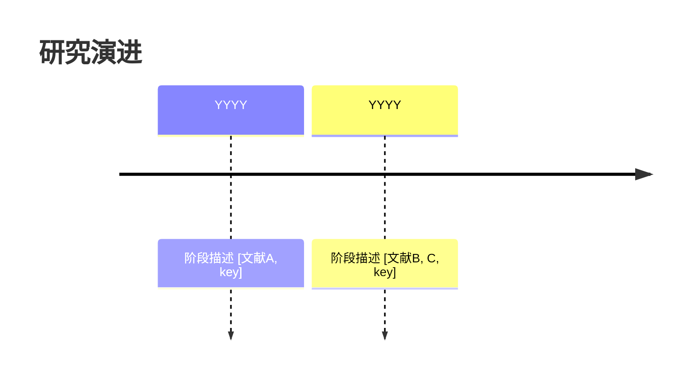

# 综合分析模板

## 输入
- 多篇文献的摘要列表
- 用户的具体研究问题

## 输出结构

### 1. 问题定义
明确界定分析的核心问题。

### 2. 证据矩阵
| 论点 | 支持文献 | 反对文献 | 证据强度 |
|------|----------|----------|----------|
| ... | [A, 2023, key] | [B, 2024, key] | 强/中/弱 |

### 3. 跨文献一致性分析
哪些发现在多项研究中得到重复验证？

### 4. 跨文献冲突分析
哪些发现存在矛盾？可能的原因（方法差异、样本差异、时间差异）？

### 5. 研究脉络时间线
使用 Mermaid timeline 图展示研究演进：

### 6. Gap 分析
- Gap 1：...
- Gap 2：...

### 7. 综合结论与建议
基于全部证据的综合判断和下一步研究建议。

## 约束
- 必须包含 Mermaid 时间线图
- 证据矩阵必须标注证据强度（强/中/弱）
- 所有论断必须有文献支撑 [Author, Year, item_key]
