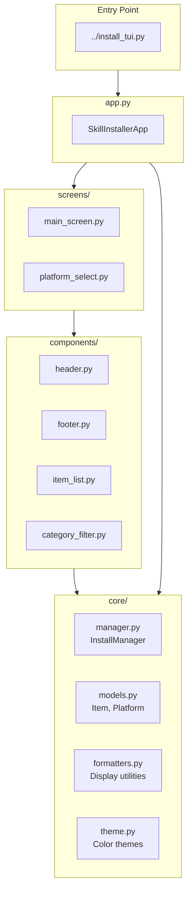

# TUI Module

> 🏠 [← Back to Root](../CLAUDE.md) | 📁 `tui/`

Textual-based Terminal User Interface for skill management.

## Overview

This module provides an interactive TUI application built with [Textual](https://textual.textualize.io/) for managing Claude Code skills across multiple platforms.

## Architecture



## Key Files

| File | Description |
|------|-------------|
| `app.py` | Main Textual application class |
| `core/manager.py` | `InstallManager` - handles async skill installation |
| `core/models.py` | Data models: `Item` (skill/command), `Platform` |
| `core/formatters.py` | Display formatting utilities |
| `core/theme.py` | Color theme definitions |
| `components/header.py` | App header component |
| `components/footer.py` | Status bar and keybindings |
| `components/item_list.py` | Skill/command list view |
| `components/category_filter.py` | Category filtering widget |
| `screens/main_screen.py` | Main application screen |
| `screens/platform_select.py` | Platform selection modal |
| `styles.tcss` | Textual CSS styles |

## Data Models

### Item
Represents a skill or command:
- `name`: Skill/command name
- `description`: Brief description
- `category`: Category for filtering
- `installed`: Installation status
- `path`: Source path

### Platform
Represents an installation target:
- `name`: Platform identifier (claude, gemini, codex, etc.)
- `skills_path`: Target skills directory
- `commands_path`: Target commands directory

## Usage

```bash
# Run TUI from project root
python install_tui.py

# Or directly
python -m tui.app
```

## Keybindings

| Key | Action |
|-----|--------|
| `i` | Install selected |
| `u` | Uninstall selected |
| `a` | Install all |
| `p` | Change platform |
| `f` | Filter by category |
| `q` | Quit |
| `↑/↓` | Navigate list |
| `Space` | Toggle selection |

## Dependencies

- Python 3.10+
- `textual` - TUI framework
- `rich` - Terminal formatting

## Testing

```bash
# Run TUI-specific tests
pytest tests/properties/test_footer_properties.py
pytest tests/properties/test_selection_properties.py
pytest tests/e2e/test_tui_e2e_project.py
```
